# Compendio Maestro: Temario Oficial Completo y Desarrollado - 1er Parcial ICSW (2026)

> **Cátedra:** Ingeniería y Calidad de Software (UTN-FRC 4K2)  
> **Docentes Titulares:** Ing. Laura Covara — Ing. Judith Meles  
> **Estructura:** Manual de estudio exhaustivo y definitivo. Todos los títulos del programa oficial desarrollados sin omisiones ni resúmenes comprimidos.  
> **Fuentes Directas:** Presentaciones oficiales de clase (01 a 08), Guía oficial de TPs Evaluables 2026 resueltos, apuntes de clase 4K2, papers canónicos (*No Silver Bullet* - Brooks, *Rapid Development* y *Software Estimation* - McConnell, *Lean Startup* - Ries, Guía Oficial Scrum 2026).

---

## Índice General del Compendio

```
├── UNIDAD 1: Fundamentos de la Ingeniería de Software, Procesos y Ciclos de Vida
│   ├── 1. Introducción a la Ingeniería del Software. ¿Qué es?
│   ├── 2. Estado Actual y Antecedentes. La Crisis del Software.
│   ├── 3. Disciplinas que conforman la Ingeniería de Software.
│   ├── 4. Ejemplos de grandes proyectos de software fallidos y exitosos.
│   ├── 5. Ciclos de vida (Modelos de Proceso) y su influencia en la Administración de Proyectos de Software.
│   ├── 6. Procesos de Desarrollo Empíricos vs. Definidos.
│   ├── 7. Ciclos de vida (Modelos de Proceso) y Procesos de Desarrollo de Software.
│   ├── 8. Ventajas y desventajas de c/u de los ciclos de vida.
│   ├── 9. Criterios para elección de ciclos de vida en función de las necesidades del proyecto y las características del producto.
│   ├── 10. Componentes de un Proyecto de Sistemas de Información.
│   ├── 11. Vínculo proceso-proyecto-producto en la gestión de un proyecto de desarrollo de software.
│   ├── 12. Paper Fundamental: No Silver Bullet - Essence and Accidents of Software Engineering (Fred Brooks).
│   ├── 13. Estimaciones Tradicionales y Cono de Incertidumbre (Steve McConnell).
│   └── 14. Respuestas Conceptuales de Oro para Judith Meles.
│
├── UNIDAD 2: Gestión Lean-Ágil de Productos, Requerimientos, User Stories, Estimaciones y Scrum
│   ├── 1. Gestión de Producto (Lean, Audacia del Cero, Hipótesis, MVP vs MMP vs MLP, MMF/MVF/MMR).
│   ├── 2. Requerimientos Ágiles (Crítica a BRUF, Pila Dinámica de Scott Ambler, Personas/Roles, Spikes).
│   ├── 3. User Stories (3 C's, Plantilla Canónica con valor en 'Para', UATs con datos, DoD vs DoR, INVEST, Anti-patrones).
│   ├── 4. Estimaciones Ágiles (Estimación Relativa, 3 componentes de SP, Fibonacci, US Canónica, Velocidad Binaria, Release Planning).
│   └── 5. Framework Scrum 2026 (Pilares empíricos, 5 Valores, Roles Developers H+IA, 5 Eventos timeboxeados, 3 Artefactos y Compromisos).
│
└── UNIDAD 3: SCM - Gestión de Configuración del Software
    └── 1. SCM (Software Configuration Management: Product Integrity, SCIs de Proyecto vs Producto, Baselines, 4 Actividades, Agile SCM, Branching Trunk-based vs GitFlow).
```

---

## Mapa Mental Integrador: El Hilo Conductor del Primer Parcial

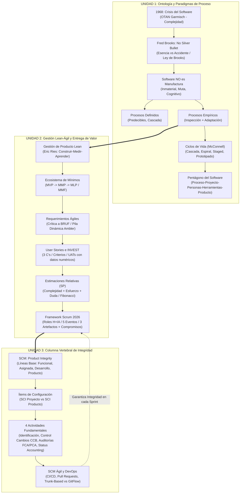

---


# UNIDAD 1: Fundamentos de la Ingeniería de Software, Procesos y Ciclos de Vida

---

## El Hilo Conductor: La Epistemología de la Unidad 1

Para comprender la Unidad 1 sin memorizar listas aisladas, hay que entender la historia como una cadena lógica de causas y consecuencias:

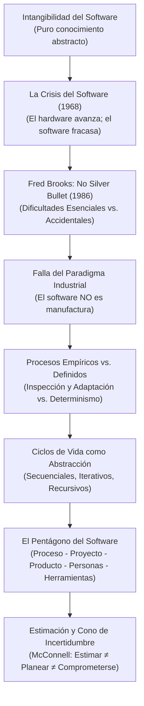

---

---

## 1. Introducción a la Ingeniería del Software. ¿Qué es?

### A. ¿Qué es realmente el Software?
En la cátedra de Judith Meles, el software **no es simplemente código fuente**. 
* **Definición de Software:** Es una configuración compleja compuesta por los **programas ejecutables**, las **estructuras de datos** que manipulan, y **toda la documentación asociada** (especificaciones de requisitos, modelos arquitectónicos, manuales operativos, casos de prueba, scripts de automatización) y las herramientas utilizadas para su construcción.
* **Definición Integradora (Slide 10):**
  > *"El software es conocimiento representado en distintos niveles de abstracción."*  
  Va desde el nivel más abstracto (la necesidad de negocio del cliente expresada en lenguaje natural) hasta el nivel más concreto y detallado (instrucciones de código máquina ejecutables en el procesador).

### B. Definición Formal de Ingeniería de Software (ISW)
* **Ian Sommerville:** Disciplina de la ingeniería que comprende todos los aspectos de la producción de software, desde las etapas tempranas de especificación hasta el mantenimiento posterior al despliegue.
* **IEEE 610.12:** Aplicación de un enfoque sistemático, disciplinado y cuantificable al desarrollo, operación y mantenimiento del software; es decir, la aplicación de principios de ingeniería al software.
* **David Parnas:** *"Construcción multipersona de software multiversión"*. Esta definición sintetiza los dos grandes problemas de la disciplina: la coordinación de personas y la gestión de la evolución en el tiempo.

### C. Las 5 Razones Ontológicas: Por qué el Software NO es Manufactura Industrial
Pregunta recurrente de parcial para evaluar comprensión propia: *"¿Por qué fracasa la gestión tradicional al intentar tratar al software como una línea de producción en serie?"*

1. **Es menos predecible:** En una línea de montaje (fábrica de autos), repetir los mismos pasos garantiza piezas idénticas. En software, factores cognitivos, ambigüedades del lenguaje humano y variaciones de entorno hacen que el resultado varíe.
2. **No hay producción en masa:** Casi ningún producto de software es igual a otro. La manufactura fabrica millones de copias de un mismo diseño; en software, el diseño **es** la construcción, y duplicar el producto final cuesta cero recursos (copiar bits).
3. **No todas las fallas son errores mecánicos:** El origen de los defectos en software es puramente conceptual y lógico (fallas de comprensión, diseño o validación), no degradación física de piezas.
4. **El software no se gasta (no sufre desgaste físico):** Una máquina se desgasta por fricción y se reemplaza por un repuesto idéntico. El software no se gasta: **muta**. Se degrada por la acumulación de cambios sucesivos, deuda técnica y obsolescencia frente a un entorno cambiante.
5. **No está gobernado por las leyes de la física:** Es una entidad abstracta e intangible, libre de limitaciones gravitacionales o de resistencia de materiales, pero restringida por los límites de la mente humana para dominar la complejidad.

---

---

## 2. Estado Actual y Antecedentes. La Crisis del Software

### D. La Crisis del Software (OTAN 1968)
* **El Origen:** En octubre de 1968, la Conferencia de la OTAN en Garmisch (Alemania), liderada por **Friedrich Bauer**, formalizó el término *Crisis del Software*. Científicos como **Edsger Dijkstra** evidenciaron que los proyectos eran sistemáticamente incapaces de entregar software libre de defectos, dentro del costo previsto y en el plazo acordado.
* **Causa Raíz:** La invención de los circuitos integrados provocó una explosión en la capacidad del hardware (Ley de Moore). Las computadoras podían ejecutar sistemas enormemente más complejos, pero las técnicas de desarrollo de software seguían siendo artesanales. Se produjo una brecha tecnológica insalvable entre una máquina veloz y un proceso de desarrollo humano, desorganizado e intuitivo.
* **Manifestaciones Actuales de la Crisis:**
  - *Demandas crecientes:* Los usuarios exigen inmediatez, disponibilidad 24/7 y aplicaciones distribuidas masivas. Los métodos burocráticos tradicionales tardan meses en autorizar un cambio, volviéndose obsoletos antes de entregar.
  - *Bajas expectativas y falta de ingeniería:* La industria se acostumbró a convivir con software defectuoso ("se cayó el sistema"). Muchas organizaciones se conforman con que el sistema "funcione", sin aplicar estándares de mantenibilidad, seguridad ni verificación técnica.

### E. Las Estadísticas del Fracaso: The Standish Group (Chaos Report)
Datos cuantitativos que sustentan la justificación teórica:
* 13.1% Requerimientos incompletos.
* 12.4% Falta de involucramiento activo del usuario.
* 10.6% Falta de recursos suficientes.
* 9.3% Expectativas irreales de la gerencia.
* 8.7% Falta de soporte ejecutivo.
* 8.1% Requerimientos cambiantes y volátiles.
* **Conclusión de Cátedra:** El **80% de los fracasos de proyectos de software** se originan en fallas durante la toma, formalización y gestión de los requerimientos.

---

### F. Las Causas del Éxito y del Fracaso según la Cátedra (Slides 21 y 22 de Presentación 01)
Pregunta clásica de parcial: *"¿Cuáles son los factores determinantes para que un proyecto de software tenga éxito o fracase?"*

| Factores de ÉXITO (Slide 21) | % Influencia | Factores de FRACASO (Slide 22) | % Influencia |
| :--- | :---: | :--- | :---: |
| **1. Involucramiento activo del usuario** | **15.9%** | **1. Requerimientos incompletos** | **13.1%** |
| **2. Apoyo explícito de la Gerencia** | **13.0%** | **2. Falta de involucramiento del usuario** | **12.4%** |
| **3. Enunciado claro de requerimientos** | **9.6%** | **3. Falta de recursos** | **10.6%** |
| **4. Planeamiento adecuado** | **8.2%** | **4. Expectativas poco realistas** | **9.3%** |
| **5. Expectativas realistas** | **7.7%** | **5. Falta de apoyo de la Gerencia** | **8.7%** |
| **6. Hitos intermedios medibles** | **7.7%** | **6. Requerimientos cambiantes** | **8.1%** |
| **7. Personas involucradas competentes** | **7.2%** | — | — |

> [!IMPORTANT]
> **Conclusión de Judith Meles (Slide 23):**  
> *"Saber programar NO es hacer Ingeniería de Software"*. Las especificaciones representan lo que el cliente cree querer, el presupuesto limita lo que se puede pagar, y lo que finalmente entregamos muchas veces no resuelve el problema si falló la ingeniería de requerimientos. Más del 80% de los fracasos tienen raíz en la mala gestión de requerimientos y expectativas, no en el código.

---

## 3. Disciplinas que conforman la Ingeniería de Software

La cátedra clasifica las disciplinas en tres grandes grupos estructurados (Slide 33 de la Presentación 01, SWEBOK v3.0 de la IEEE y notas de clase):

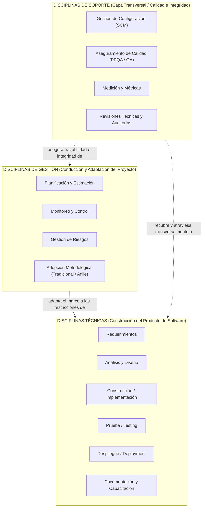

### A. Los Tres Grupos de Disciplinas

1. **Disciplinas Técnicas (Orientadas a la Construcción del Producto):**
   Comprenden las actividades operativas directas que transforman las necesidades del negocio en software ejecutable:
   - **Ingeniería de Requerimientos:** Elicitación, análisis, especificación (ERS / User Stories) y validación de necesidades.
   - **Análisis y Diseño:** Modelado conceptual, arquitectura de software, interfaces y esquemas de datos.
   - **Construcción / Implementación:** Codificación, refactorización, depuración y pruebas unitarias.
   - **Prueba / Testing:** Verificación y validación funcional y no funcional (integración, regresión, pruebas de caja negra y pruebas de aceptación de usuario UAT).
   - **Despliegue (Deployment):** Empaquetado, distribución, migración de datos, instalación en infraestructura y puesta en producción.
   - **Documentación y Capacitación:** Manuales técnicos, guías operativas y entrenamiento a usuarios finales.

2. **Disciplinas de Gestión (Orientadas a la Conducción del Proyecto):**
   Comprenden las actividades de liderazgo, organización, monitoreo y control del esfuerzo temporal:
   - **Planificación y Estimación:** Determinación cuantitativa de esfuerzo, costos y plazos, armando cronogramas o sprints.
   - **Monitoreo y Control:** Seguimiento del progreso real contra el plan previsto (burndowns, hitos) y aplicación de acciones correctivas.
   - **Gestión de Riesgos:** Identificación, análisis de impacto y probabilidad, planes de contingencia y seguimiento continuo.
   - **Adopción y Adaptación Metodológica (*Tailoring*):** Ajuste de marcos tradicionales o ágiles a las restricciones concretas del proyecto.

3. **Disciplinas de Soporte (Transversales de Calidad e Integridad):**
   Son independientes de la tecnología y **atraviesan transversalmente todo el proceso** garantizando la integridad del producto:
   - **Gestión de Configuración del Software (SCM):** Identificación de ítems de configuración (SCI), control de versiones, líneas base (*baselines*), comités de control de cambios (CCB) y contabilidad de estado.
   - **Aseguramiento de Calidad de Proceso y Producto (PPQA / QA):** Evaluación objetiva e independiente para verificar el cumplimiento de procesos, estándares y procedimientos.
   - **Medición y Métricas de Software:** Recolección objetiva de datos (esfuerzo, defectos, cobertura, velocidad) para la toma de decisiones informada.
   - **Revisiones Técnicas Formales y Auditorías:** Inspecciones cruzadas de código/diseño y auditorías de configuración física (PCA) y funcional (FCA).

---

### B. Cómo se Articulan las Disciplinas con el Proceso de Desarrollo (Pregunta Clave de Judith Meles)

Pregunta típica de parcial: *"¿Cómo interactúan las disciplinas de gestión y de soporte con las disciplinas técnicas dentro del ciclo de vida?"*

* **La Gestión ADAPTA el marco:** Las disciplinas de gestión toman el marco conceptual abstracto y lo adaptan (*tailoring*) al contexto particular del proyecto (tamaño del equipo, experiencia, cultura organizacional, criticidad y restricciones de tiempo).
* **El Soporte RECUBRE y ATRAVIESA transversalmente:** Las disciplinas de soporte son **independientes del modelo de ciclo de vida elegido**. Se aplican tanto en Cascada como en RUP o Scrum. Recubren a todas las disciplinas técnicas desde el primer día de requerimientos hasta el mantenimiento post-entrega, asegurando que los cambios no destruyan la integridad del producto ni degraden su calidad.

---

### C. Cuerpos de Conocimiento Oficiales: SWEBOK y SEBoK (Slides 25 a 32)
* **SWEBOK v3.0 (IEEE 2014):** *Software Engineering Body of Knowledge*. Define las **15 Áreas de Conocimiento (KA - Knowledge Areas)** que conforman formalmente la profesión de la ingeniería de software:
  1. Requerimientos de Software
  2. Diseño de Software
  3. Construcción de Software
  4. Pruebas de Software (Testing)
  5. Mantenimiento de Software
  6. Gestión de la Configuración del Software (SCM)
  7. Gestión de la Ingeniería de Software
  8. Procesos de la Ingeniería de Software
  9. Modelos y Métodos de Ingeniería de Software
  10. Calidad de Software
  11. Práctica Profesional de la Ingeniería de Software
  12. Economía de la Ingeniería de Software
  13. Fundamentos de Computación
  14. Fundamentos Matemáticos
  15. Fundamentos de Ingeniería
* **SEBoK v1.9.1 (2018):** *Systems Engineering Body of Knowledge*. Extiende la ingeniería de software al dominio de sistemas completos (hardware, personas, procesos, servicios y sistemas de sistemas - SoS).

---

## 4. Ejemplos de grandes proyectos de software fallidos y exitosos

### A. Casos Emblemáticos de Grandes Proyectos Fallidos (Analizados por la Cátedra)

1. **Toyota Prius (2014 - Slide 8 de Presentación 01):**
   * **El Hecho:** Toyota tuvo que llamar a revisión a más de 1.9 millones de automóviles híbridos Prius en todo el mundo.
   * **La Falla de Software:** Un defecto en el software de control del inversor híbrido provocaba que, bajo ciertas condiciones de aceleración intensa, los transistores se recalentaran y el vehículo entrara inesperadamente en "modo a prueba de fallos", apagando el motor de combustión en plena marcha y dejando al conductor sin potencia motriz en autopistas.
   * **Lección de Ingeniería:** El software embebido en sistemas críticos no permite parches improvisados; la falta de validación exhaustiva de estados límite de hardware-software pone en riesgo vidas humanas.

2. **Lanzador Espacial Ariane 5 (Vuelo 501 - 1996 - Slide 7):**
   * **El Hecho:** El cohete de la Agencia Espacial Europea se autodestruyó a los 37 segundos del despegue, con una pérdida de más de 500 millones de dólares y carga científica irremplazable.
   * **La Falla de Software:** Un desbordamiento aritmético (*integer overflow*) no manejado. Una rutina de software heredada del Ariane 4 intentó convertir un valor de velocidad horizontal de punto flotante de 64 bits a un entero con signo de 16 bits. La aceleración del Ariane 5 era sustancialmente mayor a la del Ariane 4, superando el valor máximo de 32767. El computador principal interpretó el volcado de memoria del error como datos de orientación y ordenó a las toberas girar bruscamente a 90 grados, desgarrando la nave por fuerzas aerodinámicas.
   * **Lección de Ingeniería:** Reutilizar componentes de software sin revalidar rigurosamente sus precondiciones, asunciones operativas y contratos de interfaz en el nuevo entorno es una de las fallas más catastróficas de la ingeniería.

3. **Sistema Automatizado de Equipaje del Aeropuerto Internacional de Denver (1995):**
   * **El Hecho:** La inauguración del aeropuerto se retrasó 16 meses, acumulando pérdidas superiores a 500 millones de dólares.
   * **La Falla de Software:** El sistema distribuido de control de carros de equipaje presentó fallas masivas de concurrencia, sincronización en tiempo real y tolerancia a fallos entre sensores ópticos, switches mecánicos y controladores centrales. Los carros arrojaban el equipaje, chocaban entre sí o quedaban atascados en bucles infinitos.
   * **Lección de Ingeniería:** Subestimación masiva de la complejidad distribuida en tiempo real y creer que una fecha límite fija de negocio puede imponerse a la madurez de la arquitectura de software sin prototipado temprano ni pruebas incrementales.

4. **Máquina de Radioterapia Therac-25 (1985–1987):**
   * **El Hecho:** Provocó la muerte o lesiones gravísimas por sobredosis masiva de radiación a al menos 6 pacientes en Estados Unidos y Canadá.
   * **La Falla de Software:** Una condición de carrera (*race condition*) en el software del operador. Si un técnico experimentado escribía rápidamente los comandos en el teclado corrigiendo un parámetro en menos de 8 segundos, el software activaba el haz de electrones de máxima potencia sin interponer el colimador de protección físico, porque la variable de estado no se había sincronizado.
   * **Lección de Ingeniería:** Eliminar trabas físicas de hardware confiando ciegamente en software no auditado, y la ausencia de diseño a prueba de fallos (*fail-safe*).

### B. Proyectos Exitosos y Factores Clave de Éxito
Frente a estos fracasos, la cátedra destaca que los proyectos de software exitosos no dependen de la "genialidad heroica" de programadores aislados, sino de la disciplina ingenieril y la gestión rigurosa:
* **Los 3 Factores Top para el Éxito de un Proyecto (Slide 56 de Presentación 06):**
  1. **Monitoreo & Feedback continuo:** Inspección frecuente del producto ejecutable real frente a las expectativas del cliente.
  2. **Tener una misión/objetivo claro:** Visión de producto unívoca, compartida por todos los miembros del equipo y los stakeholders.
  3. **Comunicación fluida y transparente:** Eliminar silos organizacionales entre desarrolladores, usuarios y negocio.
* **Causas Principales de Fracaso en Proyectos (Slide 57 de Presentación 06):**
  - Fallas al definir el problema de negocio.
  - Planificar basado en datos insuficientes o suposiciones sin sustento histórico.
  - La planificación la hizo un grupo aislado de planificadores ("en una torre de marfil") sin involucrar a quienes construyen.
  - Ausencia de seguimiento y monitoreo real del plan.
  - Plan de proyecto excesivamente pobre en detalles o con estimaciones improvisadas.
  - Nadie claramente a cargo del proyecto y de la toma de decisiones.

---

## 5. Ciclos de vida (Modelos de Proceso) y su influencia en la Administración de Proyectos de Software

### A. Jerarquía Conceptual
Pregunta obligatoria de múltiple opción y desarrollo:
* **Ciclo de Vida:** Es una **representación simplificada y abstracta de un proceso**. Grafica la secuencia de etapas, sus transiciones y los criterios de entrada y salida entre fases.
* **Proceso de Desarrollo:** Es la **implementación concreta** del ciclo de vida; define las actividades técnicas detalladas, métodos, prácticas, roles y artefactos de trabajo.
* **Proyecto:** Es la **instanciación y adaptación** del proceso a un contexto específico con recursos y fechas determinadas.

```text
[Ciclo de Vida: Abstracción de etapas]
       │
       ▼ se implementa mediante
[Proceso de Desarrollo: Actividades, métodos, roles, artefactos]
       │
       ▼ se instancia y adapta en
[Proyecto: Esfuerzo temporario particular con Personas y Restricciones]
```

### B. Ciclo de Vida del Producto vs. Ciclo de Vida del Proyecto
* **Ciclo de Vida del Proyecto:** Es temporario. Nace con un objetivo específico (ej. construir la versión 1.0 o el MVP) y termina formalmente con la entrega y aceptación del entregable.
* **Ciclo de Vida del Producto:** Es estratégico y de largo plazo. Comienza con la concepción de la idea y atraviesa las etapas de *Introducción $\to$ Crecimiento $\to$ Madurez (operación y mantenimiento continuo) $\to$ Retiro definitivo del mercado*.
* **Axioma:** **A lo largo de la vida de un mismo producto de software se ejecutan múltiples proyectos sucesivos.**

---

### C. Influencia Directa del Ciclo de Vida en la Administración de Proyectos (Slides 42 a 46 de P01)
El modelo de ciclo de vida seleccionado es el marco operativo que condiciona **todas** las actividades de gestión:
1. **En la Planificación:** Define si la planificación se realiza en un único esfuerzo masivo inicial (modelo en cascada) o si se planifica de forma continua y adaptativa en horizontes cortos (iterativo/incremental).
2. **En la Visibilidad del Avance:** En modelos secuenciales documentales, el avance se mide en documentos firmados (diseños, especificaciones), lo que genera una "falsa sensación de avance" hasta que el código se integra al final. En modelos incrementales/evolutivos, el avance se mide exclusivamente mediante software funcional entregado.
3. **En la Gestión del Riesgo:** Un modelo en espiral ataca los riesgos mayores en las primeras iteraciones; un modelo en cascada posterga la integración y las pruebas al final, maximizando el riesgo de sorpresas catastróficas.
4. **En el Control de Costos y Cambios:** La tolerancia al cambio de alcance está directamente ligada al ciclo de vida. Forzar un cambio de requerimientos al final de una cascada incrementa el costo hasta 200 veces (Boehm); en ciclos ágiles/evolutivos, el cambio es absorbido en el siguiente ciclo con costo marginal.

---

## 6. Procesos de Desarrollo Empíricos vs. Definidos

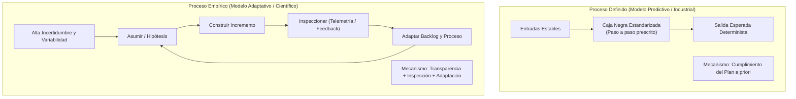

### Cuadro Comparativo Exhaustivo (Evaluado en Parciales)

| Dimensión | Proceso Definido | Proceso Empírico |
| :--- | :--- | :--- |
| **Inspiración conceptual** | Líneas de ensamblaje industrial y manufactura en masa. | Método científico, investigación y procesos creativos complejos. |
| **Premisa operativa** | Repetir el mismo proceso bajo condiciones idénticas produce **siempre el mismo resultado**. | Operamos con variables humanas y tecnológicas cambiantes; repetir el proceso genera **resultados diferentes**. |
| **Mecanismo de control** | Estandarización y planificación detallada *a priori* (control predictivo). | **Inspección frecuente y adaptación continua** (control empírico). |
| **Los 3 Pilares** | Planificación, Asignación de tareas, Control de desvíos. | **Transparencia, Inspección y Adaptación**. |
| **Gestión del cambio** | El cambio se percibe como una desviación indeseable que debe ser reprimida por control de cambios formal. | El cambio se percibe como aprendizaje emergente y ventaja competitiva. |
| **Ciclo del conocimiento** | Lineal y unidireccional: *Planear $\to$ Ejecutar $\to$ Verificar*. | Circular y continuo: *Asumir $\to$ Construir $\to$ Retroalimentar $\to$ Revisar $\to$ Adaptar*. |

> [!WARNING]
> **La Trampa de Examen de Laura Covara (Corrección 2024 / 2025):**
> *"Si elegimos un ciclo iterativo e incremental, ¿cuál es la diferencia entre plantear una iteración en un proceso empírico vs. uno definido?"*
> 
> * **Respuesta Errónea (calificada con 5/10 por Covara):** *"En el proceso definido una iteración es una fase como análisis o diseño, y en el empírico es el producto entero"*. **Falso.** Eso confunde Cascada con Iterativo.
> * **Respuesta Perfecta (10/10):**
>   - En un **proceso definido iterativo** (ej. RUP formal cerrado), el alcance, objetivo y arquitectura de **todas las iteraciones se planifican de manera predictiva al inicio del proyecto**; cada iteración ejecuta un plan prescrito esperando resultados determinados y el alcance total no se altera sin comités burocráticos.
>   - En un **proceso empírico iterativo** (ej. Scrum), cada iteración (Sprint) parte de una hipótesis de valor. Al finalizar, **se inspecciona el incremento real funcionando** ante los usuarios reales y **se adaptan el backlog y las iteraciones futuras** en función del aprendizaje obtenido. El plan evoluciona con el software.

---


---

## 7. Ciclos de vida (Modelos de Proceso) y Procesos de Desarrollo de Software

### A. La Distinción Fundamental: Proceso vs. Ciclo de Vida
Pregunta frecuente de Judith Meles: *"¿Es lo mismo un Proceso de Desarrollo que un Modelo de Ciclo de Vida?"*
* **El Proceso de Desarrollo:** Es el conjunto completo y detallado de **actividades, métodos, prácticas, roles, herramientas y transformaciones** que el equipo ejecuta para desarrollar y mantener el software (definición Sw-CMM / IEEE). Describe **el QUÉ, QUIÉN y CÓMO detallado**.
* **El Ciclo de Vida (Modelo de Proceso):** Es una **representación simplificada y abstracta** de ese proceso. Describe el **flujo de trabajo y el orden temporal** de las fases, estableciendo los criterios de transición de una tarea a la siguiente desde una perspectiva particular (Slide 44 de P01).

### B. Las Tres Familias Básicas de Ciclos de Vida (Slide 45 de Presentación 01)
1. **Secuencial:** Las fases se suceden de forma estrictamente lineal. Una fase no comienza hasta que la anterior está completamente terminada y aprobada (ej. Cascada Puro).
2. **Iterativo / Incremental:** El desarrollo se divide en múltiples ciclos (iteraciones). En cada iteración se produce un incremento funcional ejecutable que añade valor o refina el sistema previo (ej. Entrega por Etapas, Scrum).
3. **Recursivo:** El proceso se descompone jerárquicamente en subprocesos idénticos aplicados a distintas escalas o componentes del sistema (ej. Espiral de Boehm, subproyectos).

### C. El Catálogo Formal de Steve McConnell (*Rapid Development*, Capítulo 7)
La cátedra adopta formalmente la taxonomía exhaustiva de Steve McConnell en su obra canónica *Rapid Development* (Desarrollo Rápido de Proyectos de Software), donde clasifica y analiza 9 modelos de ciclo de vida según su idoneidad para proyectos reales.

---

## 8. Ventajas y desventajas de c/u de los ciclos de vida

### C. Catálogo Completo de Modelos de Ciclo de Vida

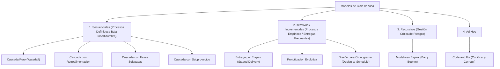

#### 1. Code and Fix (Codificar y Corregir)
* **Mecánica:** Se programa directamente sin requisitos ni diseño previo. Se codifica y se parcha hasta que el cliente no encuentra más fallas inmediatas.
* **Ventajas:** Cero tiempo invertido en planificación, estimación o documentación; arranque instantáneo.
* **Desventajas:** Mantenimiento peligrosamente caro; código sin arquitectura ("espagueti"); imposible de testear de forma repetible; falla catastróficamente al superar las mil líneas de código.
* **Uso exclusivo:** Proyectos personales descartables (*throwaway*) o pruebas de concepto de una sola tarde.

#### 2. Modelo en Cascada Puro (Waterfall)
* **Mecánica:** Secuencia lineal y ordenada: *Requisitos $\to$ Análisis $\to$ Diseño $\to$ Codificación $\to$ Pruebas $\to$ Despliegue*. Cada fase debe completarse al 100% y firmarse documentalmente antes de pasar a la siguiente. No hay solapamiento.
* **Ventajas:** Excelente control documental; encuentra defectos conceptuales temprano si los requisitos son perfectos; ideal para equipos inexpertos o con alta rotación de personal (la documentación define exactamente qué hacer).
* **Desventajas:** Inflexible ante cambios; no produce software ejecutable hasta el final del cronograma; descubrir un error de requisitos en la fase de pruebas genera un costo de retrabajo exponencial.
* **Cuándo usarlo:** Requisitos completamente estables, conocidos y congelados desde el primer día; dominios técnicos totalmente dominados; proyectos donde la calidad formal prima sobre el plazo.

#### 3. Cascada con Retroalimentación
* **Mecánica:** Similar a la cascada pura, pero permite retroceder a la fase inmediata anterior al detectar defectos o inconsistencias técnicas.
* **Ventajas:** Reconoce que la ingeniería de requisitos no es perfecta.
* **Desventajas:** Retrabajo costoso; dificulta la gestión del cronograma cuando los retornos son frecuentes.

#### 4. Cascada con Fases Solapadas
* **Mecánica:** Permite iniciar la fase siguiente (ej. comenzar el diseño de la base de datos) antes de que la fase previa (especificación de requerimientos) haya cerrado formalmente.
* **Ventajas:** Reduce el tiempo total de entrega al mercado (*Time-to-Market*).
* **Desventajas:** Aumenta el riesgo de desperdicio: si los requerimientos que aún no cerraron modifican aspectos ya diseñados, hay que rehacer trabajo.

#### 5. Cascada con Subproyectos
* **Mecánica:** Secuencial hasta completar el diseño arquitectónico global; a partir de allí, el sistema se descompone en subsistemas independientes que avanzan en cascadas paralelas coordinadas.
* **Ventajas:** Permite paralelizar el trabajo con múltiples equipos técnicos.
* **Desventajas:** Riesgo crítico en la etapa de integración final si las interfaces entre subsistemas no fueron especificadas rigurosamente.

#### 6. Entrega por Etapas (Staged Delivery)
* **Mecánica:** Realiza la especificación, el análisis y el diseño de la **totalidad del sistema al inicio**, pero descompone la implementación y entrega en **sucesivas etapas funcionales** que se liberan al cliente de forma incremental.
* **Ventajas:** El cliente obtiene funcionalidad utilizable en etapas tempranas; permite obtener retroalimentación operativa antes de finalizar todo el proyecto.
* **Desventajas:** Requiere una arquitectura inicial sumamente robusta para soportar entregas modulares; los requisitos no deben sufrir cambios radicales.

#### 7. Modelo en Espiral (Barry Boehm)
* **Mecánica:** Ciclo recursivo guiado por el análisis de riesgos. Cada vuelta de la espiral recorre 4 cuadrantes:
  1. *Determinar objetivos, alternativas y restricciones.*
  2. ***Identificar y resolver riesgos*** (mediante análisis detallado, simulación o prototipos).
  3. *Desarrollar y verificar el producto del nivel actual.*
  4. *Planificar la siguiente fase.*
* **Ventajas:** El foco primordial es la **mitigación proactiva del riesgo**; a medida que aumenta el costo acumulado, el riesgo residual disminuye; adecuado para proyectos de ciclo largo y misión crítica.
* **Desventajas:** Exige especialistas senior en evaluación de riesgos; la gestión del riesgo puede resultar más costosa que el propio desarrollo; no permite entregas funcionales tempranas al usuario final; difícil de auditar por hitos contractuales estándar.
* **Cuándo usarlo:** Proyectos gigantescos, complejos, con alta incertidumbre técnica o contractual donde el fracaso implique pérdidas millonarias o vidas humanas.

#### 8. Prototipación Evolutiva
* **Mecánica:** Se construye rápidamente un prototipo funcional rudimentario centrado en las funciones que el usuario necesita. El usuario interactúa con él, provee feedback y el prototipo se refina en ciclos sucesivos hasta convertirse en el sistema final desplegable.
* **Ventajas:** Elimina la ambigüedad en los requerimientos; el cliente ve resultados de inmediato; excelente para investigar interfaces complejas e innovadoras.
* **Desventajas:** Riesgo de degradación de la arquitectura por parches sucesivos; el cliente puede confundir un prototipo visual rápido con un sistema robusto y exigir que se ponga en producción antes de estar listo.
* **Cuándo usarlo:** Requerimientos altamente volátiles o desconocidos; clientes que no logran verbalizar lo que necesitan; tecnologías nuevas donde se desconoce la mejor solución técnica.

#### 9. Diseño para Cronograma (Design-to-Schedule)
* **Mecánica:** La fecha de entrega final y el presupuesto son innegociables. Las funcionalidades se priorizan de forma estricta. Si el tiempo se agota, **se descartan las funcionalidades secundarias**, garantizando la entrega en fecha con la funcionalidad núcleo.
* **Ventajas:** Cumplimiento garantizado del cronograma; evita horas extras y agotamiento del equipo.
* **Desventajas:** El alcance final entregado es variable.
* **Cuándo usarlo:** Proyectos condicionados por fechas regulatorias o eventos comerciales fijos (ej. software para los Juegos Olímpicos o liquidación impositiva anual).

---


---

## 9. Criterios para elección de ciclos de vida en función de las necesidades del proyecto y las características del producto

### D. Matriz de Decisión para Justificación en Examen

Para responder con nota máxima a una pregunta de selección de ciclo de vida, se deben contrastar las características del dominio contra estas 6 variables:

| Factor de Evaluación | Cascada Puro | Entrega por Etapas | Prototipación Evolutiva | Espiral (Boehm) |
| :--- | :--- | :--- | :--- | :--- |
| **Claridad de Requisitos** | Claros, completos y congelados al inicio. | Claros globalmente; implementados en bloques. | Desconocidos, ambiguos o emergentes. | Complejos con incertidumbre en viabilidad técnica. |
| **Nivel de Riesgo** | Bajo o dominado técnicamente. | Medio; dependencias controladas. | Medio; enfocado en la interfaz/adopción. | **Crítico o catastrófico**. |
| **Madurez del Equipo** | Novatos o alta rotación (guiados por documentos). | Madurez técnica media/alta en arquitectura. | Desarrolladores rápidos y adaptables. | **Expertos senior en gestión de riesgos**. |
| **Urgencia del Cliente** | Puede esperar al final del proyecto. | Necesita entregas intermedias para operar. | Necesita ver resultados visuales ya. | Ciclo largo; prima la seguridad sobre el apuro. |
| **Entregas Parciales** | No admite entregas parciales. | **Admite entregas parciales planificadas**. | El software crece iterativamente. | Entregas internas de mitigación de riesgo. |

---


---

## 10. Componentes de un Proyecto de Sistemas de Información

### A. Definición de Proyecto
Un proyecto es un **esfuerzo temporario** que se lleva a cabo para crear un producto, servicio o resultado **único**.
* Posee una fecha de inicio y una fecha de finalización determinadas.
* No es una operación continua ni repetitiva.

### B. Distinción Clave: Alcance de Producto vs. Alcance de Proyecto
* **Alcance del Producto:** Todas las características, funcionalidades y requisitos técnicos que deben estar presentes en el software terminado.  
  *¿Contra qué se valida su cumplimiento?:* Contra la **Especificación de Requerimientos** (ERS o User Stories del Backlog).
* **Alcance del Proyecto:** Todo el trabajo (y *únicamente* el trabajo) necesario para construir y entregar el producto con la calidad acordada.  
  *¿Contra qué se controla su cumplimiento?:* Contra el **Plan de Proyecto** (cronograma, asignación de tareas, WBS).

---

### C. La Triple Restricción Tradicional y Ampliada (Slides 33 a 35 de Presentación 06)
* **Los Tres Factores Clásicos (The Triple Constraint):**
  1. **Alcance (Objetivos):** ¿Qué es lo que el proyecto está tratando de alcanzar? Las capacidades y requerimientos comprometidos.
  2. **Tiempo (Calendario):** ¿Cuánto tiempo debería llevar completarlo? La fecha límite comprometida.
  3. **Costo (Presupuesto):** ¿Cuánto debería costar? Los recursos económicos, servidores, licencias y salarios.
* **El Cuarto Elemento Rector: La CALIDAD:**
  El balance entre Alcance, Tiempo y Costo **determina directamente la Calidad** del software entregado.
  - Si el cliente recorta el tiempo sin reducir el alcance ni aumentar los recursos, la calidad se degrada (deuda técnica, defectos en producción).
  - Si se agregan requerimientos (alcance) sin ajustar tiempo ni costo, el proyecto colapsa.
  - Proyectos de alta calidad son aquellos que entregan el producto requerido satisfaciendo los objetivos de alcance en el tiempo y costo acordados.

---

## 11. Vínculo proceso-proyecto-producto en la gestión de un proyecto de desarrollo de software

### C. El Pentágono Sistémico del Software (Slide 35 de Presentación 06)

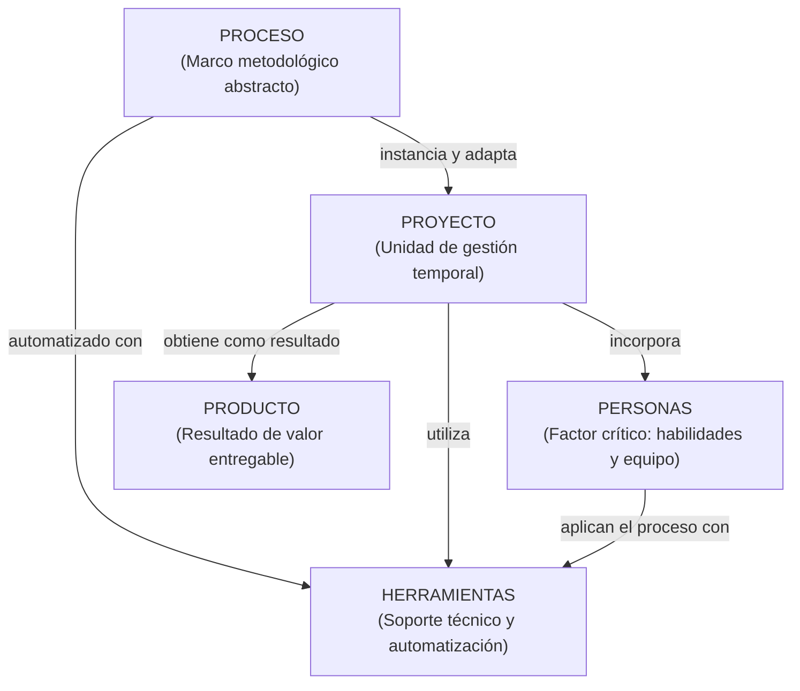

#### Dinámica de los 5 Vértices:
1. **PROCESO:** La definición metodológica (actividades, roles, métodos y artefactos).
2. **PROYECTO:** La unidad de gestión temporaria donde el Proceso se **instancia y adapta** (*tailoring*) al contexto particular del negocio.
3. **PERSONAS:** El factor crítico primordial; aportan habilidades cognitivas, motivación y trabajo colaborativo. Sin personas competentes, ningún proceso funciona.
4. **HERRAMIENTAS:** Dan soporte operativo y **automatizan** las tareas del proceso (IDEs, Git, CI/CD, linters).
5. **PRODUCTO:** El resultado tangible entregado (código ejecutable, arquitectura, documentación) que soluciona la necesidad del cliente.

---


---

## 12. Paper Fundamental: No Silver Bullet - Essence and Accidents of Software Engineering (Fred Brooks)

En 1986, Frederick Brooks escribió el paper definitivo de la disciplina: *No Silver Bullet - Essence and Accidents of Software Engineering*.

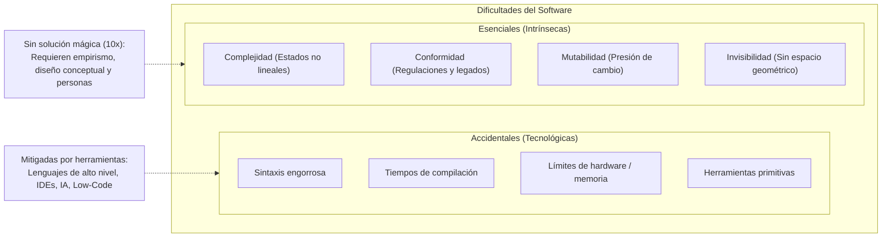

### A. Dificultades Accidentales vs. Dificultades Esenciales

> [!NOTE]
> **Dificultades Accidentales:** Aquellas inherentes a las limitaciones de la tecnología disponible en un momento histórico dado, pero que **no forman parte de la naturaleza misma del software**.  
> *Ejemplos superados:* Restricciones de memoria RAM, sintaxis binaria o assembler, tiempos de compilación de horas, procesamiento por lotes (batch). Hoy, herramientas como la IA generativa, frameworks modernos y plataformas Low-Code continúan reduciendo el trabajo accidental (escribir boilerplate, autocompletar código).

> [!IMPORTANT]
> **Dificultades Esenciales:** Propiedades inherentes e inevitables del software. Son 4 y no pueden eliminarse mediante ninguna herramienta tecnológica:
> 1. **Complejidad:** El software es más complejo para su tamaño que cualquier construcción humana, porque no existen dos partes idénticas (a diferencia de un edificio con miles de ladrillos iguales). La cantidad de estados posibles crece de forma combinatoria exponencial, haciendo imposible probar o prever mentalmente todas las interacciones.
> 2. **Conformidad:** El software no responde a leyes físicas universales (como la gravedad en ingeniería civil). Debe amoldarse arbitrariamente a instituciones humanas, leyes fiscales, regulaciones burocráticas y sistemas legados preexistentes, los cuales cambian sin lógica técnica.
> 3. **Mutabilidad:** Al carecer de materia física, el software está sometido a una presión social constante para ser modificado. Cuando un sistema tiene éxito, los usuarios descubren nuevos usos y exigen cambios que la arquitectura original no contemplaba.
> 4. **Invisibilidad:** El software es geométricamente invisible. No posee dimensiones espaciales. Si intentamos representarlo mediante diagramas (flujo de control, estructura de datos, llamadas de funciones), cada gráfico captura una sola dimensión desconectada del resto, ocultando la totalidad del sistema.

### B. El Mito del Hombre-Mes y la Ley de Brooks
En su libro *The Mythical Man-Month* (1975), Brooks ataca la falacia de estimar proyectos multiplicando personas por tiempo:
* **El hombre y el mes son recursos intercambiables solo en tareas divisibles sin comunicación entre trabajadores** (como cosechar trigo).
* Cuando una tarea tiene dependencias secuenciales intrínsecas, el esfuerzo no acorta el tiempo: *"Gestar un bebé toma nueve meses, sin importar cuántas mujeres se asignen a la tarea"*.

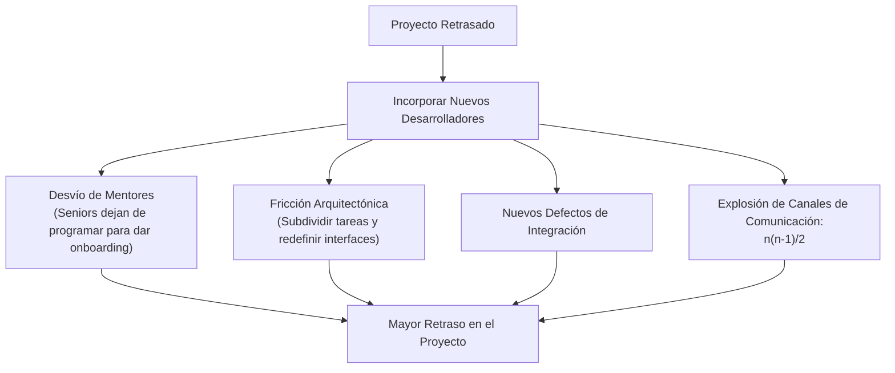

> [!CAUTION]
> **Ley de Brooks (Cita textual obligatoria de examen):**  
> *"Añadir personal a un proyecto de software que ya está retrasado, lo retrasará aún más."*
>
> **Las 4 Causas Obligatorias de Justificación:**
> 1. **Desvío de mentores productivos:** Los desarrolladores experimentados deben abandonar su trabajo técnico para capacitar a los nuevos integrantes (*onboarding*).
> 2. **Fricción por repartición del trabajo:** Subdividir módulos en curso obliga a rediseñar componentes y genera retrabajo.
> 3. **Aparición de defectos de interfaz:** Al aumentar el número de desarrolladores, aumenta la superficie de contacto entre módulos, disparando los errores de integración.
> 4. **Crecimiento combinatorio de canales de comunicación:**
>    $$\text{Canales} = \frac{n(n - 1)}{2}$$
>    - Para 4 personas: 6 canales.
>    - Para 8 personas: 28 canales.
>    - Para 12 personas: 66 canales.  
>    El esfuerzo requerido para mantener sincronizado al equipo supera ampliamente la capacidad productiva de los nuevos integrantes.

### C. Integridad Conceptual y Equipo Quirúrgico
* **Integridad Conceptual:** Es el criterio rector de la calidad arquitectónica. Un sistema debe transmitir una única filosofía de diseño, como si hubiera surgido de la mente de un solo arquitecto.
* **El Equipo Quirúrgico:** Brooks propone estructurar los equipos en torno a un **Cirujano (Arquitecto líder)** que toma las decisiones y escribe el código central, rodeado de un copiloto, un administrador (que gestiona burocracia y recursos), editores de documentación y especialistas técnicos, reduciendo al mínimo los canales cruzados de comunicación.
* **Efecto del Segundo Sistema (*Second-System Effect*):** Es el sistema más peligroso que diseña un ingeniero. Habiendo contenido su ambición en el primer sistema por falta de tiempo o experiencia, el arquitecto vuelca en el segundo todas las características secundarias, complejidades barrocas y adornos que tenía postergados, haciéndolo colapsar por sobre-ingeniería.

---


---

## 13. Estimaciones Tradicionales y Cono de Incertidumbre (Steve McConnell)

### A. Estimar $\neq$ Planear $\neq$ Comprometerse
* **Estimación:** Una predicción probabilística e inherentemente inexacta basada en datos históricos y supuestos técnicos.
* **Plan:** Cómo se pretende organizar las tareas y los recursos para alcanzar los objetivos.
* **Compromiso:** Un acuerdo vinculante con fecha de entrega, presupuesto y alcance pactados ante los stakeholders.

### B. El Cono de Incertidumbre (*Cone of Uncertainty*)

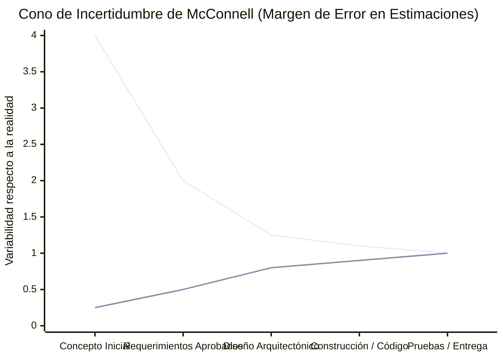

* Al inicio del proyecto (fase de concepto/especificación inicial), el margen de variabilidad de la estimación oscila entre **$0.25\times$ y $4.0\times$** respecto a la realidad final (un factor de $16\times$ de diferencia entre el optimista y el pesimista).
* Conforme se avanza en el proyecto, se toman decisiones de diseño y se completa código, el cono converge hacia $1.0\times$.
* **Causa primaria del fracaso de la gestión tradicional:** Forzar al equipo a firmar **compromisos de costo y plazo fijos** en la parte más ancha del cono de incertidumbre.

### C. Métodos Tradicionales de Estimación
* **Juicio de Experto:** Estimación intuitiva realizada por un profesional senior. Su gran riesgo es la dependencia crítica de esa persona.
* **Estimación a Tres Puntos (Distribución Beta / PERT):**
  $$\text{Esfuerzo} = \frac{O + 4H + P}{6}$$
  Donde $O$ es el escenario Optimista, $H$ el Habitual (más probable) y $P$ el Pesimista.
* **Wideband Delphi (Juicio de Experto Grupal):**
  - Técnica estructurada para lograr consenso grupal evitando sesgos.
  - **Pregunta de parcial:** *¿Por qué las estimaciones intermedias de Wideband Delphi deben ser secretas y anónimas?*  
    *Respuesta:* Para eliminar el **efecto de anclaje**, la presión jerárquica y el condicionamiento de los perfiles más extrovertidos o de mayor jerarquía sobre los integrantes más jóvenes.
* **Causa principal de desvío en estimaciones:** La **omisión sistemática de actividades complementarias** por optimismo de los desarrolladores (pruebas unitarias, armado de datasets, refactorización, revisiones de código, reuniones de coordinación, licencias y contingencias).

---


---

## 14. Respuestas Conceptuales de Oro para Judith Meles

1. **¿Qué es software?:** Es conocimiento representado en distintos niveles de abstracción; comprende programas ejecutables, documentación asociada y estructuras de datos.
2. **¿Por qué el software no es manufactura?:** Porque es intangible, no se desgasta físicamente (muta), no se fabrica en serie, es cognitivo y menos predecible.
3. **¿Cuál fue la causa de la Crisis del Software?:** El desacoplamiento entre el crecimiento exponencial del hardware y la naturaleza artesanal/humana del desarrollo de software.
4. **¿Qué demostró Brooks con "No Silver Bullet"?:** Que ninguna herramienta tecnológica puede lograr por sí misma un salto de $10\times$ en una década, porque las herramientas mitigan dificultades *accidentales*, mientras que las dificultades *esenciales* (complejidad, conformidad, mutabilidad, invisibilidad) son inherentes e incurables.
5. **¿Qué dice la Ley de Brooks y por qué?:** Añadir personal a un proyecto retrasado lo retrasa más, debido al desvío de mentores en onboarding, fricción por repartición del trabajo, nuevos errores de interfaz y la explosión de canales de comunicación según $n(n-1)/2$.
6. **¿Por qué el desarrollo de software es un proceso empírico?:** Porque opera en entornos complejos con variables cambiantes e incertidumbre; su control no se logra estandarizando a priori, sino mediante **transparencia, inspección frecuente y adaptación continua**.
7. **¿Cuál es la relación entre ciclo de vida y proceso de desarrollo?:** El ciclo de vida es una **representación abstracta y simplificada de un proceso**; el proceso es la implementación metodológica concreta; el proyecto es su instanciación y adaptación.
8. **¿Qué diferencia el ciclo de vida del proyecto del ciclo de vida del producto?:** El proyecto es temporario y acotado a un entregable; el producto es de largo plazo y contiene múltiples proyectos a lo largo de su existencia.
9. **¿Cuándo se elige el modelo en Cascada y cuándo el Espiral?:** Cascada cuando los requisitos son claros, completos y estables, con baja incertidumbre técnica. Espiral cuando el proyecto es gigantesco, de ciclo largo y existen riesgos críticos o catastróficos que deben mitigarse antes de construir.
10. **¿Qué representa el Pentágono del Software?:** El Proceso se instancia y adapta en el Proyecto, que es automatizado con Herramientas, incorpora Personas con habilidades y obtiene como resultado el Producto.


---

# UNIDAD 2: Gestión Lean-Ágil de Productos, Requerimientos, User Stories, Estimaciones y Scrum

---

## El Hilo Conductor: La Epistemología de la Unidad 2

En la Unidad 1 comprendimos que el software es intangible y complejo (Brooks), y que por ende no puede gestionarse como una línea de producción en serie (proceso definido), requiriendo un **proceso empírico** basado en inspección y adaptación.

La Unidad 2 materializa este empirismo en la práctica ingenieril a través de 5 pilares articulados:

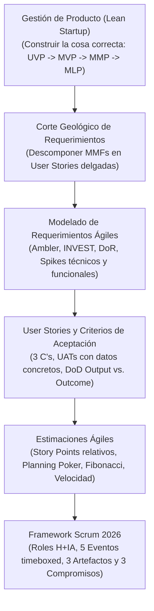

---

---

## 1. Gestión de Producto

### A. La Filosofía Lean y la Paradoja del Valor (Slide 3 y 4 de Presentación 05)
* **Axioma de Eric Ries (*The Lean Startup*):**
  > *"El mayor riesgo en el desarrollo de software no es fallar técnicamente, sino construir a la perfección algo que nadie quiere."*
* **Creación de Valor vs. Desperdicio (*Waste*):** El pensamiento Lean define la creación de valor como **proveer beneficios reales, perceptibles y medibles a los clientes**. Cualquier actividad, documento o línea de código que no contribuya directamente a resolver el problema del cliente es desperdicio puro.
* **La Paradoja de Construir Más para Entregar Menos (Datos de la Industria):**
  - **45% de las funcionalidades desarrolladas en un sistema típico NUNCA se utilizan.**
  - 19% se utilizan raramente.
  - 16% se utilizan a veces.
  - 13% se utilizan a menudo.
  - **Solo el 7% se utilizan siempre.**
* **Conclusión de Cátedra:** Escribir código no es sinónimo de crear valor. La productividad de un equipo de ingeniería no se mide por la cantidad de funcionalidades entregadas, sino por la **adopción real y el retorno de inversión del cliente**.

### B. La Brecha Evolutiva del Ingeniero de Software
Para Judith Meles, el desafío más difícil de cruzar en la formación del ingeniero es la transición entre dos mentalidades:
* **Focalizado en Tareas (Mentalidad de Desarrollador Artesanal):** Piensa en entidades de base de datos, tablas, algoritmos, pantallas y características técnicas aisladas. Pregunta: *"¿Qué tengo que programar?"*
* **Focalizado en Experiencias (Mentalidad de Ingeniero de Producto):** Diseña **contextos de uso y valor humano**. Entiende el flujo de vida del usuario, reduce la fricción operativa y mide si el software resuelve una necesidad real. Pregunta: *"¿Qué problema de negocio estamos resolviendo y cómo medimos su éxito?"*

### C. La Trampa de "La Audacia del Cero" y el Ciclo Lean Startup
* **La Audacia del Cero (*The Audacity of Zero*):** Es el incentivo perverso que tienen los equipos tradicionales de retrasar el lanzamiento del producto buscando la "perfección". Mientras el producto no sale a la luz, el número de clientes es cero y los ingresos son cero, lo cual permite que los inversores y la gerencia sigan viviendo en una fantasía de potencial infinito.
* **El Costo del Retraso (*Cost of Delay*):** Cada semana que se pospone el lanzamiento para agregar features secundarias aumenta el esfuerzo desperdiciado, pierde retroalimentación temprana del mercado y maximiza el riesgo de construir un fracaso masivo.
* **El Antídoto Empírico:** Diseñar un experimento mínimo para confrontar la realidad lo antes posible:
  $$	ext{Construir (Producto / MVP)} \longrightarrow 	ext{Medir (Telemetría / Datos reales)} \longrightarrow 	ext{Aprender (Validar Hipótesis / Pivotar)}$$

### D. Casos de Estudio Reales Analizados por la Cátedra (Slide 8, 9 y 10)
1. **Dropbox (Prueba de Humo / *Smoke Test*):**
   - *El Reto Técnico:* Integración compleja a nivel de kernel de múltiples sistemas operativos (Windows, Mac, Linux) y almacenamiento distribuido masivo en la nube. Construir la arquitectura completa sin saber si los usuarios la entenderían era un riesgo de millones de dólares.
   - *El Experimento (MVP):* Drew Houston grabó un **video banal de 3 minutos** narrando la experiencia de arrastrar un archivo a una carpeta y ver cómo se sincronizaba. **¡No había producto real construido!** Era una simulación visual.
   - *Resultado:* La lista de espera beta pasó de 5.000 a **75.000 personas de la noche a la mañana**, validando la demanda con costo casi nulo antes de escribir el código complejo de red.
2. **Facebook (Validación Temprana en Dos Vías - 2004):**
   - Con ingresos casi nulos y solo 150.000 usuarios en universidades, levantó \$500.000 de capital de riesgo. ¿Por qué? Porque validó dos hipótesis de comportamiento humano:
   - **Track 1 - Hipótesis de Valor:** ¿El producto entrega valor al usarlo? Métrica: *Tasa de retención diaria*. Más del **50% de los usuarios registrados volvían al sitio todos los días**, pasando horas dentro de la plataforma.
   - **Track 2 - Hipótesis de Crecimiento:** ¿Cómo descubren el producto nuevos usuarios? Métrica: *Viralidad orgánica*. En un solo mes, el **75% del campus de Harvard lo utilizaba con \$0 invertidos en publicidad**.

---

### E. La Anatomía del Producto Mínimo Viable (MVP)
* **¿Qué es un MVP?:** Es la versión más pequeña y económica de un producto que permite a un equipo recolectar la **máxima cantidad de aprendizaje validado sobre los clientes con el menor esfuerzo posible**.
* **Cómo NO hacer un MVP (El error del producto fragmentado):** Construir solo la base de datos o solo la interfaz gráfica. Si no funciona de punta a punta, no es viable.
* **Cómo SÍ hacer un MVP (El corte vertical cohesivo):** Proveer una experiencia básica pero completa que abarque funcionalmente las cuatro capas: **Diseño básico + Usabilidad elemental + Fiabilidad técnica + Valor funcional real**. Debe resolver el problema central del *Happy Path*.

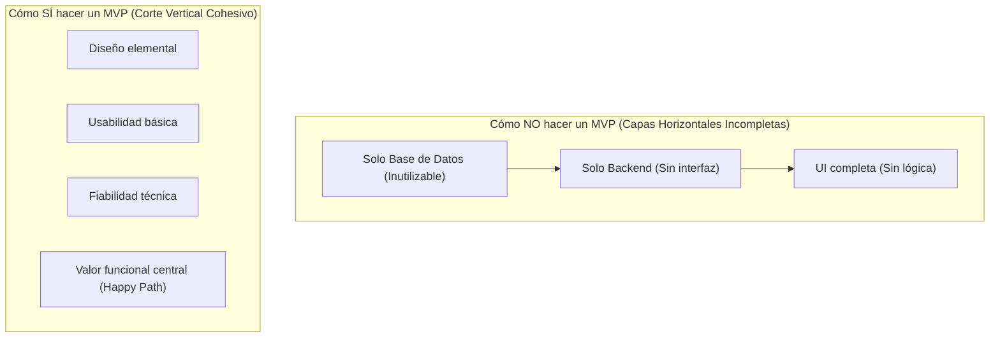

### F. Señales de Mercado y el Pivote (Slide 12 y 13)
* **UVP (Propuesta de Valor Única):** La hipótesis principal; lo que hace único al producto frente a alternativas existentes.
* **Fase A (La Señal Dispersa):** El equipo lanza el MVP y los usuarios dicen: *"Es genial, pero le falta la función X"*, y cada usuario pide una función X totalmente distinta. **Diagnóstico:** Aún no se ha encontrado un mercado ni un perfil de cliente unificado.
* **Fase B (La Señal Clara):** Todos los usuarios coinciden en demandar la misma carencia fundamental o usan el producto para un fin inesperado. **Acción:** El equipo realiza un **Pivote** (cambio estructurado de estrategia manteniendo la visión) y construye el **MVP 2**.

### G. Matriz de Priorización para el Alcance del MVP (Slide 14)
Cuadrante fundamental para justificar exclusiones en el parcial:
1. **HACER (Urgente e Importante):** Incluir en el MVP. Componentes críticos de la Propuesta de Valor Única indispensables para el flujo básico.
2. **PLANEAR (Importante pero No Urgente):** Funcionalidades de maduración y optimización para el lanzamiento comercial Beta o releases futuros.
3. **DELEGAR (Urgente pero No Importante):** Integraciones con plataformas de terceros o APIs existentes (ej. MercadoPago, autenticación con Google, servicios de envío tercerizados) en lugar de desarrollarlas desde cero.
4. **ELIMINAR (Ni Urgente ni Importante):** Desperdicio puro. Remover del Roadmap del producto.

---

### H. El Espectro de los Productos Mínimos: MVP vs. MMP vs. MLP

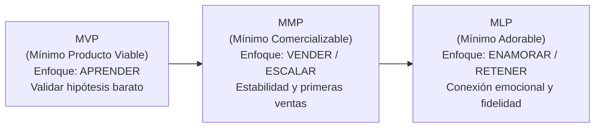

#### Cuadro Comparativo Diagnóstico (Slide 24 y 25 de Presentación 05)

| Dimensión | MVP (Viable) | MMP (Comercializable) | MLP (Adorable / *Lovable*) |
| :--- | :--- | :--- | :--- |
| **Objetivo Principal** | **Aprender y validar hipótesis de negocio** de forma económica y veloz. | **Atender a una base amplia de usuarios generales** y generar ingresos. | **Crear conexión emocional profunda, deleite y lealtad** en mercados maduros. |
| **Enfoque de Diseño** | Investigar, empatizar, prototipar; alcance mínimo indispensable. | Construir y refinar; testing riguroso, estabilidad arquitectónica. | Diseñar para el deleite; micro-interacciones pulidas, reducción radical de fricción. |
| **Público Objetivo** | *Early Adopters* (usuarios tolerantes a fallas con la necesidad urgente). | Clientes del mercado masivo (*Early Majority*). | Usuarios exigentes en mercados con competidores bien financiados. |
| **Resultado Clave** | Informar y ajustar el alcance futuro (o pivotar). | Salida formal al mercado ($MMP = MMR_1$). Calidad comercial. | Retención a largo plazo, alta recomendación (NPS) y defensa de marca. |
| **Ejemplo Típico** | Video de Dropbox, formulario manual detrás de escena. | Versión 1.0 estable lanzada a producción con facturación. | Spotify (listas Discover personalizadas), WhatsApp (simplicidad y fiabilidad extrema). |

### I. Los 10 Bloques de Construcción de la Adorabilidad del MLP (Slide 23)
En mercados saturados, lo meramente "viable" parece mediocre. El MLP busca impactar en estos 10 bloques cognitivos:
1. **Inspiración:** Ayuda al usuario a perseguir un propósito o estilo de vida significativo.
2. **Crecimiento:** Fomenta el desarrollo personal o profesional del usuario.
3. **Confianza en uno mismo:** Hace que el usuario se sienta capaz e inteligente al usar la interfaz.
4. **Utilidad:** Resuelve el problema de raíz con mínima cantidad de pasos.
5. **Esperanza:** Brinda soluciones a problemas que antes se creían imposibles de resolver.
6. **Halo / Estatus:** El usuario siente orgullo o pertenencia al utilizar la herramienta.
7. **Motivación:** Estimula la acción continua mediante refuerzos positivos inmediatos.
8. **Diversión / Deleite:** Micro-animaciones, sonidos agradables y respuestas visuales fluidas.
9. **Escala:** Funciona con la misma solidez para diez que para diez millones de usuarios.
10. **Satisfacción y Cuidado:** El usuario percibe que la empresa se preocupa genuinamente por sus necesidades humanas.

### J. Granularidad del Ecosistema de Mínimos: MMF vs. MVF vs. MMR (Slide 15 a 19)
* **MMF (Minimum Marketable Feature):** La pieza más pequeña de funcionalidad con **alta certeza comercial** que puede liberarse aportando valor inmediato al cliente y crecimiento a la empresa. Reduce el *Time-to-Market*.
* **MVF (Minimum Viable Feature):** Funcionalidad pionera con **alta incertidumbre**, diseñada como un pequeño experimento dentro de un producto maduro para evaluar una nueva línea de valor.
* **MMR (Minimum Marketable Release):** Cada paquete de incremento que se libera formalmente al mercado conteniendo un conjunto de MMFs. El primer release formal dirigido a clientes generales es el MMP ($MMP = MMR_1$).
* **El Corte Geológico (*Geological Slice* - Slide 16):** Aunque un MVP o un MMF son atómicos desde la perspectiva de negocio (no se puede aprender de algo más chico), son gigantescos para los desarrolladores. Las **User Stories** son las rebanadas finas de ejecución técnica que atraviesan todas las capas tecnológicas (UI, lógica de negocio, datos) para implementar un MMF de forma incremental.

---

---

## 2. Requerimientos Ágiles

### A. El Manifiesto Ágil: Los 4 Valores y los 12 Principios Fundacionales (Febrero 2001)

El enfoque ágil tiene su partida formal de nacimiento en **febrero de 2001**, cuando 17 líderes de la industria del software (Kent Beck, Martin Fowler, Ken Schwaber, Jeff Sutherland, Ward Cunningham, Alistair Cockburn, Bob Martin, entre otros) se reunieron en Snowbird, Utah, y proclamaron el **Manifiesto por el Desarrollo Ágil de Software (*Agile Manifesto*)**.

El Manifiesto se estructura en dos niveles inseparables: **4 Valores Fundamentales** y **12 Principios Operativos**.

#### 1. Los 4 Valores del Manifiesto Ágil
La declaración canónica establece una comparación directa entre el paradigma tradicional (derecha) y el paradigma ágil (izquierda):

> *Estamos descubriendo formas mejores de desarrollar software tanto por nuestra propia experiencia como ayudando a terceros. A través de este trabajo hemos aprendido a valorar:*
>
> 1. **Individuos e interacciones** por sobre *procesos y herramientas*.
> 2. **Software funcionando** por sobre *documentación extensiva*.
> 3. **Colaboración con el cliente** por sobre *negociación contractual*.
> 4. **Respuesta ante el cambio** por sobre *seguir un plan*.
>
> *Esto es, aunque reconocemos valor en los elementos de la derecha, **valoramos más los de la izquierda**.*

* **Desglose de los 4 Valores según la Cátedra:**
  * **01. Individuos e interacciones por sobre procesos y herramientas:** El software es una actividad creativo-humana. Ningún proceso por más maduro que sea (CMMI, RUP) ni ninguna herramienta avanzada puede compensar la falta de comunicación, motivación o talento de las personas.
  * **02. Software funcionando por sobre documentación extensiva:** No implica "cero documentación". Significa documentar *Just-in-Time* lo estrictamente necesario que agregue valor y mantenga el conocimiento transparente. La medida real de avance es código probado y ejecutable, no especificaciones teóricas de 300 páginas.
  * **03. Colaboración con el cliente por sobre negociación contractual:** El enfoque tradicional de cliente vs. proveedor crea trincheras legales rígidas. El agilismo integra al cliente dentro del equipo (representado en Scrum por el Product Owner) para co-crear el producto de manera continua.
  * **04. Respuesta ante el cambio por sobre seguir un plan:** Los requerimientos son naturalmente cambiantes y mutables (Brooks). Apegarse ciegamente a un plan prefijado conduce al fracaso comercial; abrazar el cambio brinda ventaja competitiva.

---

#### 2. Los 12 Principios del Manifiesto Ágil
Son las directrices prácticas que sustentan los 4 valores y dan sustento a los Requerimientos Ágiles y a Scrum:

1. **Satisfacción del Cliente:** Nuestra mayor prioridad es satisfacer al cliente a través de la entrega temprana y continua de software con valor.
2. **Aceptación del Cambio:** Aceptamos que los requerimientos cambien, incluso en etapas tardías del desarrollo. Los procesos ágiles aprovechan el cambio para proporcionar ventaja competitiva al cliente.
3. **Entregas Frecuentes:** Entregamos software funcional con frecuencia, desde un par de semanas a un par de meses, con preferencia por los períodos más cortos.
4. **Colaboración Diaria:** Los responsables de negocio y los desarrolladores deben trabajar juntos de forma cotidiana durante todo el proyecto.
5. **Individuos Motivados:** Construimos proyectos en torno a personas motivadas. Les damos el entorno y el apoyo que necesitan, y confiamos en que realizarán la tarea.
6. **Conversación Cara a Cara:** El método más eficiente y eficaz de comunicar información al equipo de desarrollo y entre sus miembros es la conversación cara a cara.
7. **Software Funcionando:** El software funcionando es la medida principal de progreso.
8. **Desarrollo Sostenible:** Los procesos ágiles promueven el desarrollo sostenible. Patrocinadores, desarrolladores y usuarios deben poder mantener un ritmo de trabajo constante indefinidamente.
9. **Excelencia Técnica:** La atención continua a la excelencia técnica y al buen diseño mejora la agilidad (la calidad interna no es negociable).
10. **Simplicidad:** La simplicidad —el arte de maximizar la cantidad de trabajo no realizado— es esencial (no construir código que nadie pidió).
11. **Equipos Autoorganizados:** Las mejores arquitecturas, requerimientos y diseños emergen de equipos autoorganizados.
12. **Mejora Continua (Reflexión y Ajuste):** A intervalos regulares, el equipo reflexiona sobre cómo ser más efectivo para luego afinar y ajustar su comportamiento en consecuencia (origen de la Sprint Retrospective).


### A. Crítica al Tradicional BRUF (*Big Requirements Up Front* - Slide 16 de Presentación 03)
* **El Enfoque Tradicional:** Pretende que los analistas capturen y congelen el 100% de los requerimientos en un documento contractual exhaustivo (ERS) antes de permitir que comience el diseño o la codificación.
* **Por qué colapsa:**
  1. *El software es mutable por naturaleza (Brooks):* Los usuarios no saben lo que realmente necesitan hasta que interactúan con software funcionando.
  2. *El costo del cambio no es constante:* Los requisitos congelados generan documentación obsoleta que se desincroniza del código real.
  3. *Resistencia patológica al cambio:* La gestión tradicional castiga las modificaciones mediante comités burocráticos, transformando el aprendizaje del usuario en un "problema".

### B. Principios Ágiles para los Requerimientos (Slide 26 y 27)
1. Los requerimientos no son un contrato; son un **diálogo continuo**.
2. Los requerimientos emergentes y cambiantes son una **ventaja competitiva** para el cliente si el proceso tiene la agilidad para absorberlos.
3. El detalle no se vuelca al inicio; los requerimientos se detallan **en el momento justo (*Just-in-Time*)**, cuando están por entrar a un sprint.
4. La documentación exhaustiva es reemplazada por la **conversación cara a cara**, que transmite la mayor riqueza de contexto y elimina ambigüedades.

### C. La Pila Dinámica de Requisitos (Scott Ambler - Slide 23 y 24)
* El **Product Backlog** funciona como una pila vertical ordenada estrictamente por valor de negocio y riesgo:
  - **Arriba de la pila:** User Stories pequeñas, perfectamente refinadas, detalladas, estimadas y listas para entrar al próximo Sprint (cumplen el criterio *Ready* / INVEST).
  - **En el medio de la pila:** Historias de tamaño mediano (Épicas desglosadas) con menos nivel de detalle.
  - **En la base de la pila:** Épicas maestras y Temas a largo plazo con baja definición técnica, que solo se analizarán cuando ganen prioridad comercial.
* Nuevos requisitos pueden ingresar, reordenarse o eliminarse en cualquier momento sin penalización burocrática.

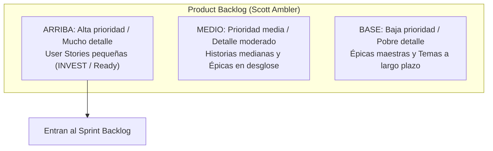

### D. Modelado de Roles de Usuario (Slide 37 a 42)
En agilidad, los requerimientos no se piensan para "el usuario" como concepto genérico abstracto:
* **Técnica de Modelado de Roles:**
  1. *Brainstorming de Roles:* Identificar todos los roles posibles que interactúan con el sistema (comprador impulsivo, administrador nocturno, supervisor de auditoría).
  2. *Agrupamiento y Consolidación:* Fusionar roles redundantes y mapear jerarquías de uso.
  3. *Tarjeta de Rol de Usuario:* Documentar atributos clave: frecuencia de uso, nivel técnico, objetivos de negocio y restricciones.
  4. *Personas Extremas (*Extreme Personas*):* Diseñar teniendo en cuenta casos límite (ej. una persona no vidente, un usuario que usa guantes de trabajo en una fábrica, un usuario con conexión 2G inestable) para descubrir requerimientos no funcionales de usabilidad que de otro modo pasarían inadvertidos.
  5. *Usuarios Representantes (*Proxies*):* Cuando el usuario final no está accesible directamente (ej. un software médico o para astronautas), se utilizan intermediarios calificados que representan sus necesidades operativas ante el Product Owner.

### E. Spikes (Slide 66 a 69)
* **Definición Formal:** Un Spike es un **tipo especial de User Story de aprendizaje e investigación** diseñado para reducir drásticamente el riesgo y la incertidumbre de una funcionalidad compleja antes de que el equipo se comprometa a estimarla y construirla.
* **Características Obligatorias:**
  - **No entregan valor de negocio directo al usuario final:** Entregan conocimiento técnico o validación de diseño.
  - **Tienen Timebox estricto:** Se les asigna una cantidad fija de horas o días; cuando el tiempo termina, el Spike se da por cerrado con el aprendizaje alcanzado.
  - **No se estiman con Story Points estándar:** Generalmente consumen capacidad fija del sprint.
* **Clasificación de Spikes:**
  1. **Spike Técnico:** Investiga la viabilidad dentro del dominio de la solución tecnológica.  
     *Ejemplos de clase:* Evaluar el rendimiento de una librería gráfica para un mapa interactivo; investigar el protocolo de integración con la pasarela de pagos de MercadoPago; probar la viabilidad de lectura de códigos QR con la cámara del dispositivo móvil; analizar decisión de arquitectura *build vs. buy*.
  2. **Spike Funcional:** Investiga la viabilidad dentro del dominio del problema y la interacción del usuario.  
     *Ejemplos de clase:* Construir un prototipo rápido de pantalla (mockup navegable) para exponerlo a 5 visitantes del parque y evaluar si entienden la distribución de sectores antes de programar la lógica del mapa.

---

---

## 3. User Stories

### A. Las 3 C's de Ron Jeffries (Slide 30 de Presentación 03)
Una User Story no es un documento de requerimientos tradicional; se compone de tres elementos inseparables:
1. **Card (Tarjeta):** El soporte físico o digital que contiene la frase verbal y la descripción sintetizada. Actúa como un **recordatorio físico de una conversación que debe suceder**, no como una especificación cerrada.
2. **Conversation (Conversación):** El diálogo continuo entre el Product Owner, los Developers y los Stakeholders durante el refinamiento y la planificación para clarificar el contexto, entender los matices y consensuar alternativas.
3. **Confirmation (Confirmación):** Los Criterios de Aceptación y las Pruebas de Aceptación de Usuario (UAT) que establecen las condiciones objetivas y verificables para que la historia se considere terminada exitosamente.

### B. La Estructura Canónica de la Tarjeta
* **Nomenclatura (Frase Verbal):** Frase verbal en infinitivo que resume la acción concreta: `[Acción] + [Objeto]` (ej. `Registrar usuario vendedor`, `Publicar producto`, `Comprar entradas`).
* **Plantilla Estándar (Connextra):**
  > **Como** [Rol específico del usuario con perfil claro]  
  > **Quiero** [Funcionalidad o capacidad técnica concreta del sistema]  
  > **Para** [Beneficio de negocio medible, auditable y justificado]

> [!WARNING]
> **Corrección Real de Laura Covara (Tema B 2025):**
> Si en el campo `Para...` escribís un beneficio vago como *"para poder ver la información"* o *"para usar la aplicación"*, Covara te anota en rojo: **"¡No queda claro el valor de negocio!"** y descuenta puntos.  
> El beneficio debe explicar la consecuencia operativa o económica: *"para auditar la distribución de fondos y garantizar la trazabilidad de los pagos"* o *"para asegurar mi lugar en el parque y evitar demoras en la boletería física"*.

---

### C. Criterios de Aceptación vs. Pruebas de Usuario (UAT)
Esta distinción es donde se producen la mayor cantidad de errores en el práctico:

* **Criterios de Aceptación (Reglas de Negocio Declarativas):**
  - Son las **políticas y restricciones del sistema** redactadas de forma declarativa.
  - Definen los límites del comportamiento aceptable: campos obligatorios, formatos esperados, rangos numéricos válidos, políticas de negocio y estados resultantes.
  - *Ejemplo:* *"La fecha límite de validez debe encontrarse entre 24 y 48 horas desde la fecha actual"* o *"El precio debe ser un valor decimal mayor a cero"*.
* **Pruebas de Aceptación de Usuario (UAT - Escenarios Operativos):**
  - Son los **casos de prueba concretos ejecutables** que verifican el cumplimiento de los criterios de aceptación.
  - **Sintaxis Exigida por Laura Covara:** `Probar [acción del usuario con datos duros específicos] y [PASA / FALLA]`.
  - **Uso de datos concretos:** No poner *"con precio inválido"*; poner *"con precio -$500 y [FALLA]"*.
  - **Significado de [FALLA]:** Significa que el sistema **bloquea la operación y advierte el error de validación esperado**, confirmando que la regla de negocio restrictiva opera correctamente.

> [!CAUTION]
> **Las 3 Correcciones en Tinta de Laura Covara en UATs Reales:**
> 1. *"¡Misma prueba!":* Ocurre cuando un alumno escribe dos pruebas negativas idénticas variando solo un sinónimo (ej. `Probar con monto negativo` y abajo `Probar con monto menor a cero`).
> 2. *"¿Diferencia con las otras que pasan?":* Ocurre cuando se escriben múltiples pruebas positivas que no prueban distintas ramas lógicas ni valores límite, sino que repiten el Happy Path.
> 3. *"Faltará describir más una oferta válida: datos numéricos":* Ocurre cuando se escribe una prueba positiva genérica como `Probar enviar oferta y recibir email (pasa)` sin detallar los datos duros que componen esa oferta válida.

---

### D. Criterio de Hecho (*Definition of Done - DoD*) vs. Criterio de Listo (*Definition of Ready - DoR*)
* **Definition of Ready (DoR):** Acuerdo del equipo que establece las condiciones que debe cumplir una User Story en el Product Backlog para poder ser seleccionada e ingresada al Sprint Backlog durante la Sprint Planning. Generalmente exige cumplir con el modelo **INVEST**, tener dependencias externas resueltas, Criterios de Aceptación redactados y estimación consensuada en Story Points.
* **Definition of Done (DoD):** Descripción formal del estado de calidad técnica que debe alcanzar el Incremento para ser considerado terminado y potencialmente desplegable a producción.
  - **Output Done (DoOD):** Verifica artefactos técnicos: código libre de advertencias de linter, pruebas unitarias e integración en verde con cobertura mínima, revisión de pares (*code review*) aprobada, merge a la rama principal y documentación actualizada.
  - **Outcome Done (DoCD):** Verifica impacto en el negocio: la funcionalidad desplegada generó la adopción, retención o métrica comercial prevista en el comportamiento del usuario.

### E. El Modelo INVEST (Bill Wake - Slide 57 de Presentación 03)
Acrónimo obligatorio que valida la calidad de una User Story:
* **I - Independent (Independiente):** La historia debe poder implementarse, probarse y desplegarse en cualquier orden sin depender rígidamente del desarrollo de otra historia (usar dobles de prueba / mocks si es necesario).
* **N - Negotiable (Negociable):** La tarjeta es una invitación a la conversación; los detalles técnicos y de alcance fino se negocian entre el Product Owner y los Developers.
* **V - Valuable (Valiosa):** Aporta valor de negocio perceptible para el cliente o usuario. Una tarea puramente técnica (ej. *"Crear tabla en la base de datos"*) no es una User Story porque no entrega valor autónomo.
* **E - Estimable (Estimable):** El equipo comprende la necesidad funcional y técnica lo suficiente como para consensuar un tamaño relativo en Story Points.
* **S - Small (Pequeña):** Tiene el tamaño adecuado para ser comenzada y completada al 100% dentro de un único Sprint.
* **T - Testable (Testeable):** Cuenta con criterios de aceptación claros y objetivos que permiten diseñar pruebas para confirmar si pasa o falla.

### F. ¿Qué NO son las User Stories y qué "huele mal"? (Slide 61 a 65)
Anti-patrones comunes que la cátedra penaliza:
1. **La historia puramente técnica:** *"Como desarrollador quiero configurar la base de datos PostgreSQL para guardar datos"*. **Huele mal:** El rol no es un usuario final del negocio y la funcionalidad no entrega valor comercial independiente. Debe ser una tarea del Sprint Backlog o parte del DoD.
2. **La historia que en realidad es una Épica gigantesca:** *"Como usuario quiero gestionar mis compras, pagos, envíos y devoluciones para operar en la plataforma"*. **Huele mal:** Viola la "S" de Small; requiere meses de desarrollo y debe desglosarse en 10 historias independientes.
3. **La historia sin beneficio o con beneficio tautológico:** *"Como vendedor quiero cargar una foto para que la foto quede cargada"*. **Huele mal:** No expresa ninguna consecuencia de valor para el negocio.
4. **La historia dependiente en cascada:** *"Como usuario quiero que se apruebe el paso 2 que depende de que se apruebe el paso 1"*. **Huele mal:** Viola la "I" de Independent.

---

---

## 4. Estimaciones Ágiles

### A. La Filosofía de la Estimación Relativa
* Los métodos tradicionales fallan porque intentan predecir el tiempo exacto en horas de tareas complejas en la parte ancha del cono de incertidumbre.
* La agilidad separa dos variables que la gestión tradicional confunde:
  $$	ext{Tamaño del Trabajo (Story Points)} \quad 
eq \quad 	ext{Duración / Calendario (Velocidad)}$$
* El equipo estima el **tamaño relativo** comparando historias entre sí; la duración se deriva empíricamente a medida que el equipo avanza y establece su ritmo histórico de entrega.

### B. Los 3 Componentes del Story Point (Pregunta Obligatoria de Examen)
Cuando se justifica una estimación en el parcial, se debe desglosar obligatoriamente la historia en estos tres factores:

```text
STORY POINT (Tamaño Relativo)
├── 1. Complejidad (Dificultad lógica, interfaces, número de entidades, algoritmos)
├── 2. Esfuerzo (Volumen físico de trabajo requerido: codificar, diseñar, probar)
└── 3. Incertidumbre / Riesgo / Duda (Desconocimiento técnico, reglas de negocio ambiguas)
```

1. **Complejidad:** Dificultad intrínseca del problema. ¿Cuántas tablas intervienen? ¿Hay validaciones cruzadas complejas? ¿Existen integraciones con librerías externas?
2. **Esfuerzo:** Cantidad de trabajo necesario para completar la historia cumpliendo con la Definition of Done (desarrollo de vistas, validaciones de frontend, endpoints de backend, suites de pruebas automatizadas).
3. **Incertidumbre / Riesgo (Duda):** ¿El equipo domina la tecnología? ¿Las reglas de negocio están claras o hay supuestos sin validar? A mayor duda, mayor debe ser el puntaje asignado.

---

### C. Planning Poker y la Escala de Fibonacci Modificada
* **Planning Poker:** Técnica de estimación colaborativa basada en consenso que utiliza tarjetas numeradas con la secuencia de Fibonacci modificada (`0, 1/2, 1, 2, 3, 5, 8, 13, 20, 40, 100, ?`).
* **¿Por qué se juega de forma simultánea y secreta?:** Para eliminar el **efecto de anclaje** (donde el primer número mencionado condiciona a todos) y neutralizar la presión de los perfiles más extrovertidos o de mayor jerarquía.
* **Dinámica de Discrepancia:** Cuando hay divergencias extremas (ej. un desarrollador vota 2 y otro vota 13), el facilitador da la palabra al voto más bajo y al más alto para que expliquen sus supuestos técnicos. Tras el debate, se vuelve a votar hasta alcanzar consenso.

### D. Decodificación Oficial de Fibonacci según la Cátedra (Slide 21 de Presentación 04)
Este criterio es el que utilizan Judith Meles y Laura Covara para evaluar si el alumno comprendió la escala:
* **0:** Funcionalidad que no insume esfuerzo perceptible o sobre la cual no se tiene la más mínima idea conceptual.
* **1/2 a 1:** Funcionalidad muy pequeña, usualmente cosmética (cambiar un texto, ajustar un botón, validación simple).
* **2 a 3:** Funcionalidad pequeña a mediana. **Es el tamaño óptimo y deseado para las User Stories que ingresan a un Sprint**.
* **5:** Funcionalidad media. Muy buen tamaño para abordar con tranquilidad en la iteración.
* **8:** Funcionalidad grande. Se puede desarrollar en el sprint, pero el equipo debe preguntarse seriamente si no conviene dividirla en historias más chicas.
* **13:** Demasiado grande. El equipo debe justificar obligatoriamente por qué no puede desglosarse antes de comprometerla.
* **20:** Épica que requiere una justificación extrema de negocio de por qué no fue dividida.
* **40:** Imposible de completar de forma segura en un sprint estándar.
* **100:** Confirmación rotunda de que algo está muy mal analizado. Mejor ni arrancar hasta descomponerla.

---

### E. User Story Canónica / Pivote (Concepto de Examen)
* **Definición:** Es una historia de usuario de tamaño pequeño a mediano, ampliamente comprendida por todos los miembros del equipo, que se utiliza como **patrón de comparación relativo (metro patrón)** para calibrar el resto de las estimaciones del backlog.
* **Por qué se elige:** Consiste en un formulario estándar de datos maestros (ej. `Registrar usuario vendedor`, `Registrar central de taxis`, `Registrar participante`) que insume poco esfuerzo, tiene complejidad baja y **cero incertidumbre técnica ni de negocio**, asignándole un valor de referencia (típicamente **1 o 2 Story Points**).
* **Por qué una historia NO puede ser canónica (Error penalizado por Laura Covara):**
  - Si una historia involucra transiciones de estado complejas, dependencias previas de otros flujos, algoritmos de cálculo o autorizaciones de negocio (ej. *"Cargar estado de aprobación de gasto"*), **NO es canónica**, porque introduce incertidumbre y complejidad que impiden usarla como patrón neutro de comparación.

---

### F. Velocidad del Equipo (*Velocity*) y el Principio Binario
* **Definición:** La velocidad es una **métrica empírica de producto y progreso** que mide la cantidad de trabajo terminado que un equipo entrega en una iteración.
* **Cómo se calcula:** Se obtiene calculando la suma de los Story Points correspondientes a las User Stories que fueron **terminadas al 100%** cumpliendo estrictamente con la Definition of Done y aceptadas por el Product Owner.
* **El Principio Binario de Cátedra:** Las historias a medio terminar (al 80% o 90%) computan **0 Story Points** para la velocidad de la iteración. No existe el progreso parcial en agilidad; o el software está potencialmente desplegable conforme al DoD o no entrega valor.
* **La Velocidad Estabilizada:** El equipo no debe alarmarse por la velocidad de un sprint aislado. La velocidad promedio a lo largo de varias iteraciones consecutivas absorbe y compensa empíricamente los errores de estimación inicial.
* **Regla estricta:** **Nunca se debe reestimar una historia porque la velocidad fue baja.** La velocidad es un termómetro; si el equipo entrega menos, la velocidad baja y el horizonte de release se ajusta solo.

### G. Velocidad vs. Capacidad (*Capacity*)

| Dimensión | Velocidad (*Velocity*) | Capacidad (*Capacity*) |
| :--- | :--- | :--- |
| **Naturaleza** | Se **CALCULA** (métrica empírica de producto y progreso). | Se **ESTIMA** (métrica de planificación de proyecto). |
| **Momento** | Al final del Sprint (en la Sprint Review). | Al inicio del Sprint (en la Sprint Planning). |
| **Qué mide** | Ritmo real histórico de entrega de valor terminado. | Disponibilidad y compromiso de trabajo para el próximo Sprint. |
| **Unidad** | Story Points terminados conforme al DoD. | Horas ideales (equipos inmaduros) o Story Points (equipos maduros). |
| **Uso** | Derivar duración de releases y calibrar el backlog. | Determinar cuántas historias del PB pueden jalarse al Sprint Backlog. |

### H. Planificación de Release (*Release Planning*)
* Se realiza al inicio del proyecto y se calibra continuamente.
* **Fórmula de Duración:**
  $$	ext{Duración del Proyecto (en Sprints)} = 
rac{\sum 	ext{Story Points del Product Backlog}}{	ext{Velocidad Promedio Histórica del Equipo}}$$
* **Cadencia de Releases (Slide 63 de Presentación 08):**
  1. *Release posterior a múltiples Sprints:* El software se empaqueta y libera al mercado al alcanzar un hito comercial o conjunto consolidado de MMFs.
  2. *Release al cierre de cada Sprint:* Cada incremento potencialmente desplegable se libera a producción de forma continua.
  3. *Release continuo por funcionalidad (DevOps / CD):* Cada feature que pasa las pruebas automatizadas del pipeline se despliega en producción de manera inmediata.

---

---

## 5. Framework Scrum

### A. La Base Empírica y los 3 Pilares
Scrum es un marco de trabajo (*framework*) liviano estructurado para generar valor adaptativo ante problemas complejos:
1. **Transparencia:** Procesos, artefactos, criterios de aceptación, DoR y DoD deben ser visibles y compartidos con un significado unívoco por todos los participantes.
2. **Inspección:** Evaluación frecuente y oportuna de los artefactos y del progreso hacia el Sprint Goal y Product Goal, sin entorpecer el trabajo operativo.
3. **Adaptación:** Corrección y ajuste inmediato del proceso o de los elementos en desarrollo ante cualquier desvío detectado fuera de tolerancias aceptables.

### B. Los 5 Valores Rectores
Compromiso (*Commitment*), Foco (*Focus*), Franqueza/Apertura (*Openness*), Respeto (*Respect*) y Coraje (*Courage*).

---

### C. El Scrum Team y las Responsabilidades (Roles)
El Scrum Team es una unidad cohesionada de profesionales enfocada en un único objetivo a la vez (**Product Goal**). Desaparecen las jerarquías internas y los subequipos:

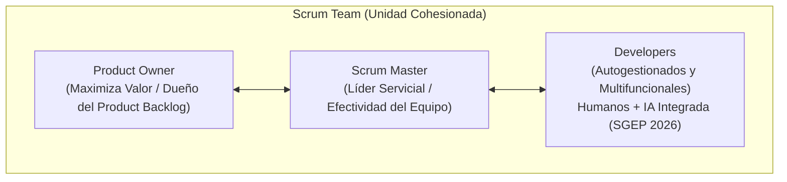

1. **Product Owner (PO):**
   - Máximo responsable de **maximizar el valor del producto** resultante del trabajo del Scrum Team.
   - Es el único responsable de la gestión efectiva del Product Backlog: definir ítems, ordenarlos por valor de negocio, asegurar que sean transparentes y entendidos por todos.
   - Representa las necesidades del negocio, los usuarios y los stakeholders.
2. **Scrum Master (SM):**
   - Responsable de la **efectividad del Scrum Team**.
   - Líder servicial (*servant-leader*) que promueve y entrena al equipo en la teoría y práctica de Scrum.
   - Remueve impedimentos organizacionales que bloquean el avance de los Developers y facilita los eventos asegurando que cumplan sus objetivos dentro del *timebox*.
   - **Regla estricta de parcial:** El Scrum Master **NO es un director de proyecto ni asigna tareas técnicas**.
3. **Developers:**
   - Personas del equipo comprometidas a crear cualquier aspecto de un **Incremento utilizable en cada Sprint**.
   - Poseen dos atributos obligatorios de cátedra:
     - **Autogestionados (*Self-managing*):** Deciden internamente *quién*, *cómo* y *cuándo* se realizan las tareas técnicas del Sprint Backlog.
     - **Multifuncionales (*Cross-functional*):** Cuentan con todas las competencias necesarias (análisis, diseño, código, testing, arquitectura) para generar el incremento sin depender de personas externas.
   - *Particularidad SGEP 2026 (Slide 36):* Composición ampliada donde los Developers combinan profesionales humanos con herramientas de **Inteligencia Artificial integrada al flujo de trabajo**.

---

### D. Los 5 Eventos y sus Timeboxes Máximos (Para Sprints de 1 mes)

| Evento | Timebox Máximo | Propósito Central | Participantes |
| :--- | :---: | :--- | :--- |
| **The Sprint** | $\le 1$ mes | Contenedor de todos los demás eventos. Genera un incremento de valor. | Scrum Team completo |
| **Sprint Planning** | **Máximo 8 horas** | Define: 1. Por qué tiene valor el Sprint (Sprint Goal), 2. Qué se hará, 3. Cómo se hará. | Scrum Team completo |
| **Daily Scrum** | **15 minutos diarios** | Inspeccionar el progreso diario hacia el Sprint Goal y adaptar el plan técnico de las próximas 24 horas. | **Exclusiva de Developers** |
| **Sprint Review** | **Máximo 4 horas** | Inspeccionar el incremento terminado en conjunto con los stakeholders y adaptar el Product Backlog. | Scrum Team + Stakeholders |
| **Sprint Retrospective** | **Máximo 3 horas** | Inspeccionar personas, procesos, relaciones y herramientas para planificar mejoras operativas continuas. | Scrum Team completo |
| *Refinamiento del Backlog* | ~10% capacidad | Actividad continua para descomponer, estimar y dar formato a los ítems del Product Backlog. | PO + Developers |

> [!NOTE]
> **El Sprint Goal es Inmutable:**
> Durante el transcurso del Sprint, **el Sprint Goal no se modifica**, ya que representa el compromiso y propósito del equipo. Lo que sí puede negociarse y ajustarse con el Product Owner son las tareas y el alcance técnico específico para cumplir dicho objetivo si el tiempo resulta insuficiente.

---

### E. Los 3 Artefactos y sus 3 Compromisos Obligatorios
Cada artefacto de Scrum materializa un compromiso explícito destinado a asegurar la transparencia y la medición objetiva del progreso:

```text
ARTEFACTO DE SCRUM                 COMPROMISO OBLIGATORIO
1. Product Backlog   ────────▶   Objetivo del Producto (Product Goal)
2. Sprint Backlog    ────────▶   Objetivo del Sprint (Sprint Goal)
3. Incremento        ────────▶   Definición de Terminado (Definition of Done - DoD)
```

1. **Product Backlog $\longrightarrow$ Compromiso: Objetivo del Producto (*Product Goal*):**
   - Describe un estado futuro del producto a largo plazo que sirve como objetivo rector para planificar el backlog.
   - El equipo debe alcanzar o abandonar formalmente un Product Goal antes de comprometer el siguiente.
2. **Sprint Backlog $\longrightarrow$ Compromiso: Objetivo del Sprint (*Sprint Goal*):**
   - Propósito único de la iteración en curso establecido durante la Sprint Planning.
   - Brinda coherencia y foco al equipo, permitiendo flexibilidad sobre cómo alcanzarlo.
3. **Incremento $\longrightarrow$ Compromiso: Definición de Terminado (*Definition of Done - DoD*):**
   - Descripción formal de las condiciones de calidad técnica que debe satisfacer el software para considerarse potencialmente desplegable.
   - En el momento en que un ítem del Product Backlog cumple con la Definition of Done, nace un Incremento.

---

### F. Herramientas de Seguimiento Gráfico
1. **Sprint Burndown Chart:** Gráfico bidimensional que proyecta la cantidad de trabajo pendiente restante (en horas ideales o tareas) contra los días hábiles del Sprint. Permite detectar estancamientos tempranos y negociar alcance con el PO antes del cierre.
2. **Sprint Burnup Chart:** Grafica el trabajo completado de forma ascendente junto a la línea de alcance total, permitiendo visualizar claramente si un desvío se debe a baja productividad o a cambios en el alcance introducidos por el PO.
3. **Release Burnup / Burndown Chart:** Visualiza la acumulación de Story Points terminados y el impacto de las modificaciones en el Product Backlog a lo largo de sucesivas iteraciones para predecir la fecha de entrega del release.

---

# UNIDAD 3: SCM - Gestión de Configuración del Software

---

## El Hilo Conductor: Por qué SCM es la Columna Vertebral de la Integridad

En las Unidades 1 y 2 aprendimos que el software es intangible y está sometido a una presión social constante de cambio (**Mutabilidad esencial de Brooks**). A medida que un proyecto crece, decenas de personas tocan archivos simultáneamente, los clientes piden modificaciones continuas y las versiones se multiplican.

Sin una disciplina formal que gobierne la evolución del software, el sistema cae en el caos: código que se sobreescribe accidentalmente, versiones que nadie sabe cuál es la correcta, componentes incompatibles y entregas que fallan en producción.

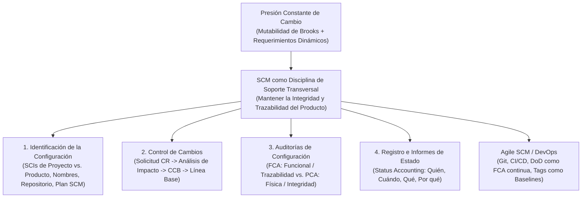

---

---

## 1. SCM (Software Configuration Management)

### A. Definición y Propósito Supremo de SCM (Slide 9 a 14 de Presentación 02)
* **Definición Formal:** SCM (*Software Configuration Management*) es una **disciplina de soporte transversal** de la ingeniería de software que aplica procedimientos técnicos y administrativos para identificar los elementos de configuración, controlar sistemáticamente los cambios sobre ellos, auditar su cumplimiento frente a requisitos y registrar el estado de su evolución a lo largo de todo el ciclo de vida.
* **Propósito Central de Cátedra:** **Mantener la integridad y trazabilidad del producto de software** gestionando la evolución del sistema para que el cambio no destruya la calidad ni la consistencia arquitectónica.
* **Por qué es una Disciplina de Soporte Transversal:**
  - No construye código directamente ni define estrategias comerciales.
  - Es **independiente del modelo de ciclo de vida elegido** (aplica exactamente igual en Cascada, RUP o Scrum).
  - Recubre y acompaña a todas las disciplinas técnicas desde la primera sesión de requerimientos hasta el retiro final del producto.

### B. La Integridad del Producto (*Product Integrity*)
Un producto de software posee integridad cuando:
1. **Satisface los requerimientos acordados:** Hace exactamente lo que el cliente y el negocio necesitan.
2. **Posee consistencia interna:** Todos sus componentes son compatibles entre sí (la interfaz gráfica dialoga correctamente con la versión actual de la API y con el esquema de base de datos vigente).
3. **Es trazable:** Se puede rastrear el origen de cada línea de código hasta el requerimiento que la justificó.

---

### C. Ítem de Configuración de Software (SCI / IC - Slide 17 y 18)
* **Definición Formal (IEEE):** Es cualquier unidad de información generada durante el ciclo de vida del software que se coloca bajo control formal de versiones y se trata como una entidad discreta en el proceso de SCM.
* **Axioma de Clase (Notas de SCM):** *"Cualquier elemento que pueda ser guardado en memoria y evolucione en el tiempo es un Ítem de Configuración."*

#### Taxonomía Obligatoria de Cátedra: SCI de Proyecto vs. SCI de Producto
Pregunta típica de parcial: *"Diferencie un ítem de configuración de proyecto de uno de producto y dé dos ejemplos de cada uno."*

| Dimensión | SCI de Proyecto | SCI de Producto |
| :--- | :--- | :--- |
| **Propósito** | Gestionar y gobernar el esfuerzo temporario del proyecto. | Constituir la solución técnica entregable al cliente. |
| **Audiencia** | Líderes de proyecto, Scrum Master, gerencia, docentes. | Desarrolladores, usuarios finales, testers, clientes. |
| **Duración** | Se archiva al finalizar el proyecto. | Evoluciona durante toda la vida útil del producto. |
| **Ejemplos Canónicos** | - **Plan de Proyecto** / Plan de SCM.<br>- **Cronograma** / Minutas de Sprint Planning.<br>- **Presupuesto** y asignación de costos.<br>- **Matriz de Riesgos** y reportes de estado.<br>- **Modalidad Académica** (en el TP de la cátedra). | - **Código Fuente** (archivos `.py`, `.java`, `.ts`).<br>- **Especificación de Requerimientos** (ERS / User Stories).<br>- **Modelos de Arquitectura y Diseño** (diagramas UML).<br>- **Casos y Suites de Prueba** (UAT, tests unitarios).<br>- **Scripts de Base de Datos** (migraciones SQL).<br>- **Manuales de Usuario y Despliegue**. |

---

### D. Versión, Variante y Rama (Slide 19 y 20)
* **Versión:** Estado de un ítem de configuración en un punto temporal específico de su evolución (ej. `v1.0.0`, `v1.0.1`). Refleja una progresión secuencial donde una versión corrige o mejora a la anterior.
* **Variante:** Versión que coexiste de manera paralela con otra versión para satisfacer restricciones operativas distintas, sin reemplazarla (ej. el software bancario compilado para arquitectura Android vs. iOS, o versión en idioma Español vs. Inglés).
* **Rama (*Branch* - Slide 32 a 34):** Línea de desarrollo independiente que se bifurca de la línea principal de desarrollo (*mainline / trunk*) para permitir que los desarrolladores trabajen en paralelo sin afectar el código estable:
  - *Feature Branch:* Rama temporal para construir una historia de usuario aislada.
  - *Release Branch:* Rama de estabilización previa a la salida a producción.
  - *Hotfix Branch:* Rama de emergencia para solucionar un defecto crítico en producción.
  - *Merge / Integración:* Fusión de los cambios de una rama hacia la línea principal, resolviendo conflictos de concurrencia.

---

### E. Línea Base (*Baseline* - Slide 27 a 31)
* **Definición Formal (IEEE / Cátedra):** Una especificación o producto de software que ha sido **formalmente revisada y acordada en un hito del proyecto**, que sirve como base para el desarrollo posterior y que **solo puede modificarse a través de un procedimiento formal de control de cambios**.
* **El Concepto de "Foto Congelada":** Una línea base es una fotografía estable del sistema en un momento determinado. Antes de alcanzar la línea base, los archivos pueden modificarse libremente por los desarrolladores; una vez aprobada la línea base, cualquier modificación exige aprobación formal.

#### Taxonomía de Líneas Base a lo largo del Ciclo de Vida (Slide 30 y 31)
Las líneas base maduran conforme avanza el proceso de desarrollo:
1. **Línea Base Funcional (*Functional Baseline*):** Se establece al cierre de la etapa de requerimientos. Contiene la ERS o el Product Backlog inicial formalmente validado con el cliente.
2. **Línea Base Asignada (*Allocated Baseline*):** Se establece al descomponer los requerimientos funcionales en subsistemas de software y hardware específicos.
3. **Línea Base de Diseño / Desarrollo (*Design Baseline*):** Se establece al aprobar la arquitectura global, modelos de datos y especificaciones de interfaces de componentes.
4. **Línea Base del Producto (*Product Baseline*):** Se establece al finalizar la construcción y testing formal; contiene el código fuente compilado, instaladores, scripts de base de datos y manuales operativos listos para ser desplegados en producción.

---

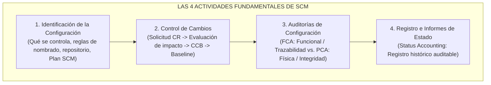

---

### Actividad 1: Identificación de la Configuración (Slide 37 a 39)
Es la actividad inicial de SCM que establece las reglas del juego antes de comenzar a producir:
1. **Selección de SCIs:** Determinar qué artefactos del proyecto estarán bajo control formal de versiones y cuáles serán temporales o descartables.
2. **Regla de Nombrado Estándar:** Definir una convención algorítmica y estricta para nombrar archivos y carpetas, evitando nombres ambiguos.  
   *Ejemplo de Cátedra (TP4):* `ISW_2026_TP_<MMDD>_<NN>_<DOMINIO_DEL_TP>.<EXT>`
3. **Estructura del Repositorio:** Diseñar el árbol de directorios que separa claramente la bibliografía, los documentos de gestión, los enunciados de TP y los entregables de código.
4. **Creación del Glosario:** Unificar el significado de términos técnicos y del dominio para que todo el equipo utilice el mismo vocabulario.
5. **Elaboración del Plan de SCM (*SCM Plan*):** Documento rector que formaliza los roles responsables, las herramientas de control de versiones a utilizar, los criterios de línea base y los procedimientos de auditoría.

---

### Actividad 2: Control de Cambios (Slide 40 a 43)
El control de cambios es el mecanismo formal para **prevenir cambios no autorizados, descontrolados o con impacto imprevisto**.

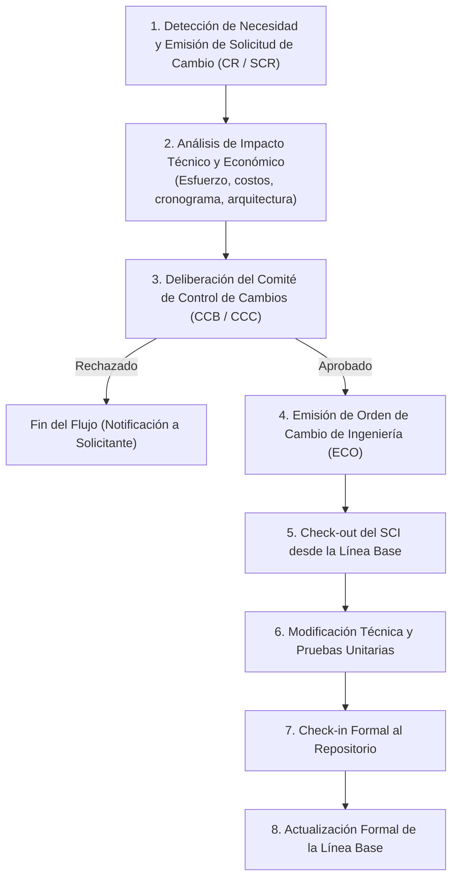

#### El Flujo Paso a Paso Tradicional:
1. **Solicitud de Cambio (*Change Request - CR / SCR*):** El cliente, un usuario o un desarrollador detecta una falla o una nueva necesidad y documenta formalmente la solicitud explicando el motivo y beneficio.
2. **Análisis de Impacto:** Los líderes técnicos y de gestión evalúan las consecuencias del cambio: *¿Cuántas horas insume? ¿Qué módulos afecta? ¿Retrasa la fecha de entrega? ¿Qué costo económico tiene?*
3. **Comité de Control de Cambios (*Change Control Board - CCB / CCC*):** Cuerpo colegiado responsable de evaluar y decidir sobre el cambio. Se compone de:
   - Director de Proyecto / Project Manager.
   - Arquitecto de Software / Líder Técnico.
   - Responsable de Aseguramiento de Calidad (PPQA / QA).
   - Representante del Cliente o Product Owner.
   - Encargado de Gestión de Configuración (SCM Manager).
4. **Decisión del CCB:** El comité puede: *Aprobar* el cambio, *Rechazarlo* (justificando motivos) o *Posponerlo* para versiones futuras.
5. **Implementación y Check-in:** Si se aprueba, se genera una Orden de Cambio, se realiza el *check-out* del artefacto de la línea base, se programa la modificación, se prueba exhaustivamente, y se realiza el *check-in* formal, dando nacimiento a una **nueva versión de la Línea Base**.

---

### Actividad 3: Auditorías de Configuración (Slide 44 a 47)
Una auditoría de configuración es una **evaluación independiente, formal y objetiva** que utiliza listas de verificación (*checklists*) para asegurar que el software esté completo y cumpla con las especificaciones antes de una entrega o despliegue.

> [!IMPORTANT]
> **Pregunta Canónica de Examen: FCA vs. PCA**
> Judith Meles y Laura Covara exigen diferenciar con precisión matemática qué valida cada una:
>
> 1. **FCA - Auditoría de Configuración Funcional (*Functional Configuration Audit*):**
>    - **Propósito:** Verificar que el software construido **cumpla efectivamente con todos los requerimientos funcionales y de rendimiento especificados**.
>    - **Pregunta que responde:** *"¿El software hace todo lo que dijimos que iba a hacer y funciona como se esperaba?"*
>    - **Herramienta Fundamental:** La **Matriz de Trazabilidad de Requerimientos** (vincula cada Requerimiento $	o$ Diseño $	o$ Código $	o$ Caso de Prueba ejecutado en verde).
>
> 2. **PCA - Auditoría de Configuración Física (*Physical Configuration Audit*):**
>    - **Propósito:** Verificar la **existencia física, integridad y consistencia** de todos los artefactos declarados en el Plan de Configuración.
>    - **Pregunta que responde:** *"¿Están físicamente presentes todos los archivos, scripts de instalación, manuales de usuario y dependencias en sus versiones correctas?"*
>    - **Herramienta Fundamental:** Lista de verificación (*checklist*) de entregables físicos, dependencias de software, esquemas de base de datos y documentación operativa.

---

### Actividad 4: Registro e Informes de Estado (*Status Accounting* - Slide 48 a 50)
* Es la actividad de SCM que mantiene un **registro histórico permanente, auditable e inmutable** de la evolución de todos los ítems de configuración.
* **Preguntas que responde con certeza matemática:**
  - *¿Qué cambió en el sistema entre la versión 1.2 y la 1.3?*
  - *¿Quién realizó cada modificación y en qué fecha exacta?*
  - *¿Por qué se realizó el cambio (a qué Solicitud de Cambio o ticket de bug corresponde)?*
  - *¿Qué requerimientos están afectados por el cambio en curso?*
  - *¿Cuál es el estado actual de la Línea Base de producción?*

---

Pregunta clásica de integración: *"¿Cómo se implementa SCM en un marco ágil como Scrum sin caer en burocracia que destruya la agilidad?"*

### A. La Transformación Operativa
En Scrum o entornos ágiles no existe un comité burocrático CCB externo que se reúna cada 15 días a sellar papeles, ni se suspende el desarrollo durante semanas para realizar auditorías manuales.

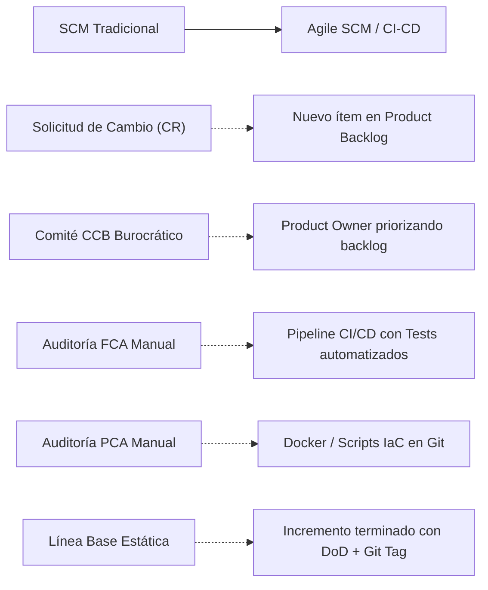

#### Cuadro de Equivalencias Operativas (De Memoria para el Parcial):

| Dimensión Tradicional | Equivalente en Agile SCM / DevOps | Justificación Técnica de Cátedra |
| :--- | :--- | :--- |
| **Solicitud de Cambio (CR)** | **Nuevo ítem en el Product Backlog**. | Los cambios ya no se ven como amenazas; son requerimientos emergentes que entran al backlog para ser priorizados por valor. |
| **Comité CCB / CCC** | **El Product Owner (PO) + Developers**. | El PO evalúa el impacto de negocio y prioriza la historia; los Developers evalúan el impacto técnico y estiman el esfuerzo en Story Points en la Planning/Refinamiento. |
| **Línea Base (Baseline)** | **El Incremento terminado con Git Tag**. | Cada Incremento que cumple al 100% con la Definition of Done (DoD) y es etiquetado con versión semántica en Git constituye una nueva Línea Base operativa. |
| **Auditoría Funcional (FCA)** | **Pipeline de CI/CD con suites de testing automatizadas**. | Cada *push* dispara pruebas unitarias, de integración y regresión. Si las pruebas pasan, el pipeline certifica automáticamente la funcionalidad contra las especificaciones. |
| **Auditoría Física (PCA)** | **Infraestructura como Código (IaC) y Docker**. | Los archivos `Dockerfile`, manifiestos de dependencias (`package.json`, `requirements.txt`) y scripts de compilación garantizan físicamente que todos los artefactos existen y compilan de forma reproducible. |
| **Contabilidad de Estado** | **Historial de commits en Git + Jira/GitHub Issues**. | Cada commit está enlazado al ID de la User Story, proveyendo trazabilidad instantánea de quién modificó qué, cuándo y por qué. |

### B. Políticas de Ramas: Trunk-Based Development vs. GitFlow
* **GitFlow (Tradicional Ágil):** Mantiene ramas de larga duración (`develop`, `release`, `main`) y ramas de feature aisladas. Es robusto para lanzamientos programados por versiones periódicas, pero introduce riesgo de conflictos complejos al integrar ramas que pasaron semanas abiertas.
* **Trunk-Based Development (DevOps Moderno):** Todos los desarrolladores integran sus cambios frecuentemente a la rama principal (*trunk/main*) al menos una vez al día, respaldados por suites de pruebas automatizadas y *Feature Flags* (banderas que ocultan funcionalidades no terminadas en producción). Esto maximiza la integración continua y elimina el "infierno de merges" (*merge hell*).
